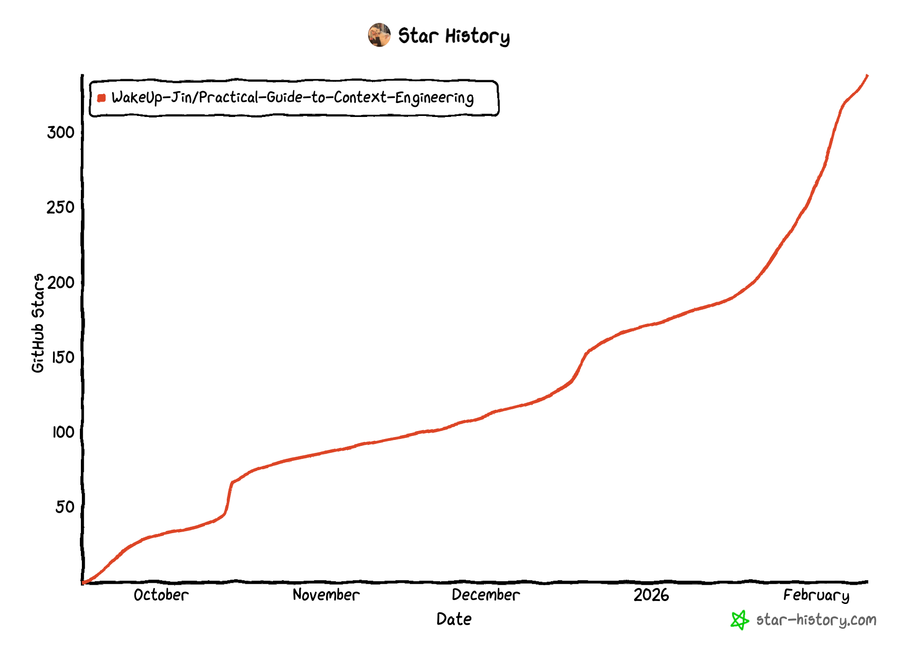

# 大模型应用开发 -上下文工程与运行空间实践指南

  

  <h2>📚 大模型应用开发 -上下文工程与运行空间实践指南</h2>
  
<em>上下文工程是设计原则，运行空间是建造目标</em>

  
  
  

  
  
  

## 项目介绍
&emsp;&emsp; 随着大语言模型（LLM）的快速发展，越来越多的开发者和企业尝试将其应用到实际业务场景中。然而，在真实落地的过程中，大家很快发现：模型本身并不是一切，决定模型表现的关键在于它所拥有的上下文。

&emsp;&emsp;上下文工程（Context Engineering）正是在这样的背景下提出的一种系统化方法论。它关注如何在有限的上下文窗口中，选择、组织并注入与用户任务高度相关的信息，从而让大模型在合理的边界内做出最佳推理与执行。

&emsp;&emsp;Harness Engineering 则是更进一步，它不仅关注上下文，更关注 Agent 的稳定运行，它为 Agent 搭建了完整的运行空间，设计了它的能力结构、协作机制和反馈闭环，让它在特定领域里稳定地产生高质量结果

本项目的目标，是为开发者和研究者提供一份大模型应用开发的骨架思路，以上下文组成作为大模型应用开发的核心，有关大模型应用开发的技术都可以互相联系起来

> 如果你的团队在做大模型应用或 Agent 相关的产品，欢迎找我聊聊。微信：`a2385472291`、email：2385472291@qq.com

## ✏️什么是上下文工程
**上下文工程的定义：是在有限的上下文窗口中，选择、组织并注入与用户输入或任务高度相关的信息，从而让大语言模型（LLM）能够在合理的边界内做出最佳推理和执行。**

上下文工程中最关键的是：**用最相关的信息填充 LLM 的上下文窗口**

如何为“用户输入”找到最相关的信息，是这个上下文工程系统的入口，也是衡量整个系统价值的核心指标，但这种“相关性”的实现并不会自然而然发生，它依赖开发者去设计、构建与优化整个系统

与 RAG 的区别是：RAG 是上下文工程中的一个子集

与提示词工程的区别是：提示词工程是专注于 LLM 最前置的正确指令艺术，其主要是：在单个文本字符串中设计完美的指令集

>  Karpathy的总结：人们通常将提示与日常使用中向 LLM 提供的简短任务描述联系起来。但在每个工业级 LLM 应用中，上下文工程是一门微妙的艺术和科学，它通过为下一步提供恰到好处的信息来填充上下文窗口。这是科学，因为正确地做到这一点涉及任务描述和解释、少量示例、RAG、相关（可能是多模态的）数据、工具、状态和历史记录、压缩等。太少或形式不正确，LLM 就没有正确的上下文来优化性能。太多或太不相关，LLM 的成本可能会上升，性能可能会下降。做好这一点非常不简单。而且，这也是艺术，因为围绕 LLM 心理和人们精神的指导直觉。
>

Karpathy的总结的链接：[https://x.com/karpathy/status/1937902205765607626?ref=blog.langchain.com](https://x.com/karpathy/status/1937902205765607626?ref=blog.langchain.com)

## ✏️什么是Harness Engineering
Harness Engineering我的理解是：**为Agent搭建运行空间，设计它的能力结构、协作机制和反馈闭环，让它在特定领域里稳定地产生高质量结果**

它不是只做限制模型能做什么的，而是在创造条件让模型能做到原本做不到的事。**这个运行空间要随着模型的升级逐渐变化**
所以大家更多应该去关注不同领域下，这个Agent的运行空间是如何构建的。

## ✏️上下文工程和Harness Engineering的关系

:palm_tree: **1、从概念范围来看：上下文工程是Harness Engineering的子集**

Harness Engineering中有些模块是直接服务于上下文（RAG、记忆、系统提示词等），有些是间接服务上下文(上下文管理，Agent评估等)，有些则是直接服务于Agent稳定运行的
但无论在哪一层，它们都在Harness Engineering这个大框架下
<!--  -->

  

> 越靠近中心，越直接操作上下文。越靠近外层，越偏向基础设施

:palm_tree: **2、从技术发展来看：这条演进路径有一条清晰的主线： 上下文 -> 上下文工程 -> Harness Engineering**

最早，我们只关注"塞给模型什么内容"，这是上下文本身的问题。随着需求复杂化，开始系统性地管理上下文的构建方式，于是有了上下文工程。而当 Agent 承担起更复杂的任务，单靠上下文管理已经不够，我们需要为它搭建完整的运行环境——Harness Engineering 由此出现。

> 它不是替代，而是一次扩展，每一个阶段都在前一个阶段基础上，往外多包了一层

:sunny: **上下文工程是设计原则，Agent Harness 是构建目标**
Harness Engineering 负责将其落地为稳定运行的 Agent 环境

## 📖 内容导航

### 一、全局认知
- [上下文工程](./docs/概述/上下文工程.md)：上下文工程的定义、与 RAG 的区别、与提示词工程的区别、Karpathy 的总结 ✅
- [Harness Engineering](./docs/概述/Harness%20Engineering.md)：Harness Engineering 的定义、与上下文工程的关系 ✅
- [基于上下文工程的 Agent 后端设计](./docs/前言/从零到一：基于上下文工程的%20Agent%20后端设计.md)：从零到一的 Agent 后端设计总览 ✅

### 二、大模型应用开发基础技术
- [RAG 策略](./docs/RAG技术/RAG策略-index.md)：从检索增强生成的流程拆解到优化方法，涵盖索引构建、检索策略、融合方式 ✅
- [搜索代理](./docs/搜索代理/搜索代理.md)：搜索代理的原理、实现方式、优化方法 ✅

### 三、上下文核心模块
> 围绕七种上下文类型，每种上下文衍生出对应的工程模块，这是本项目的主体部分

- **系统提示词** *(待补充)*
- **工具管理**
  - [工具管理概述](./docs/工具管理模块/工具管理.md) ✅
  - [工具调度与权限模块的开发](./docs/工具管理模块/工具调度与权限模块的开发.md) ✅
  - [为你的Agent集成Skill系统](./docs/工具管理模块/为你的Agent集成Skill系统.md) ✅
  - [ClaudeCode逆向工程（Kode）的工具定义和管理](./docs/工具管理模块/ClaudeCode逆向工程（Kode）的工具定义和管理%20-TS版本.md) ✅
- **用户记忆** *(待补充)*
- **会话存储**
  - [Redis缓存后端存储设计-读穿｜写穿](./docs/会话存储模块/Redis缓存后端存储设计-读穿｜写穿.md) ✅
  - [多后端存储设计-备份降级策略](./docs/会话存储模块/多后端存储设计-备份降级策略.md) ✅
- **结构化输出**
  - [JSON结构化输出的方法](./docs/结构化输出模块/JSON结构化输出的方法.md) ✅
  - [LLM输出格式成本：为什么JSON比TSV成本更高](./docs/结构化输出模块/LLM%20输出格式成本：为什么%20JSON%20比%20TSV%20成本更高.md) ✅
- **LLM 模块**
  - [LLM服务层的实现设计](./docs/LLM模块/LLM服务层的实现设计.md) ✅
  - [Cipher的LLM 服务架构分析文档](./docs/LLM模块/Cipher的LLM%20服务架构分析文档%20-TS版本.md) ✅

### 四、上下文管理：跨模块的全局策略
- [上下文管理策略](./docs/上下文管理/上下文管理.md)：上下文裁剪、压缩、去重、隔离等策略 ✅
- [Token 压缩策略](./docs/上下文管理/Token压缩策略.md)：各类压缩方法对比：摘要、向量聚合、句子窗口检索 ✅
- [上下文压缩：ClaudeCode、Gemini 与工具消息裁剪](./docs/上下文管理/上下文压缩：ClaudeCode、Gemini与工具消息裁剪.md)：上下文压缩的原理、实现方式、优化方法 ✅

### 五、Agent 运行空间
- **Agent 形态**
  - [两种世界的交互形态：协同Agent与自主Agent](./docs/Agent形态/两种世界的交互形态：协同Agent与自主Agent.md) ✅
  - [智能体系统构建策略：单智能体和多智能体](./docs/Agent形态/智能体系统构建策略-单智能体和多智能体.md) ✅
- **Agent 评估**
  - [Agent的评估](./docs/Agent评估/Agent的评估.md)：Agent 的评估方案和方法 ✅
  - [实现Agent的评估器-TS版本](./docs/Agent评估/实现Agent的评估器-TS版本.md)：Agent 评估器 TS 版本实现 ✅
  - [揭秘 AI 代理的评估 - 多种Agent的评估方法](./docs/Agent评估/评估多种类型Agent的方法.md) ✅

### 六、实践与案例
- [ReasonCode 项目介绍](./docs/ReasonCode开发设计文档/首页：ReasonCode项目介绍.md) ✅
- [AI协作编码 - Anthropic 黑客马拉松冠军 - ClaudeCode配置整理和补充](./docs/AI协作编码与上下文工程/Anthropic%20黑客马拉松冠军-%20ClaudeCode配置整理和补充.md) ✅

### 附录
- [更新日记](./docs/更新日记/更新日记.md)：记录项目更新的内容进度

## 🤝 如何贡献

我希望「上下文工程实践」不仅是一个仓库，而是一个大家共同探索、共同建设的开放空间。
欢迎以你喜欢的方式加入进来：

- 🐛 <strong>报告 Bug</strong> - 发现内容或代码问题，请提交 Issue
- 💡 <strong>提出建议</strong> - 对项目有好想法，欢迎发起讨论
- 📝 <strong>完善内容</strong> - 帮助改进教程，提交你的 Pull Request
- ✍️ <strong>分享实践</strong> - 在"上下文工程实践项目"中分享你的学习笔记和项目

开始贡献前，请阅读 [详细贡献指南](./贡献指南.md)，了解具体的提交规范和流程。

每一份贡献，无论大小，都是推动这个项目前进的重要力量。期待看到你的身影！🎉

## 🙏 致谢

### 核心贡献者
- [WakeUpJin-项目负责人](https://github.com/WakeUp-Jin) (一位享受阅读和积累知识的开发者)
- [Linux.Do 社区](https://linux.do/latest) (真诚 、友善 、团结 、专业)

## Star History

    

  
⭐ 如果这个项目对你有帮助，请给我们一个 Star！

## 关于WakeUp-Jin

文章合集也会同步更新到微信公众号，方便手机端阅读。公众号上除了项目内容外，还会分享我平时关于学习的记录和生活的思考

  
  
扫描二维码关注WakeUp-Jin

## 📜 开源协议

本作品采用[知识共享署名-非商业性使用-相同方式共享 4.0 国际许可协议](http://creativecommons.org/licenses/by-nc-sa/4.0/)进行许可。
