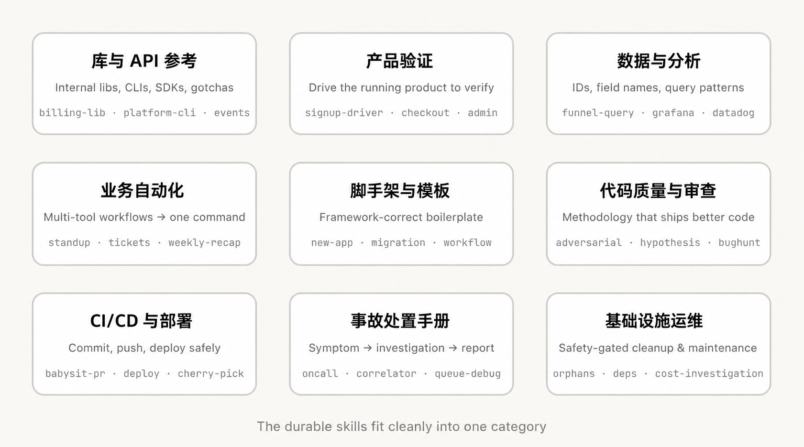
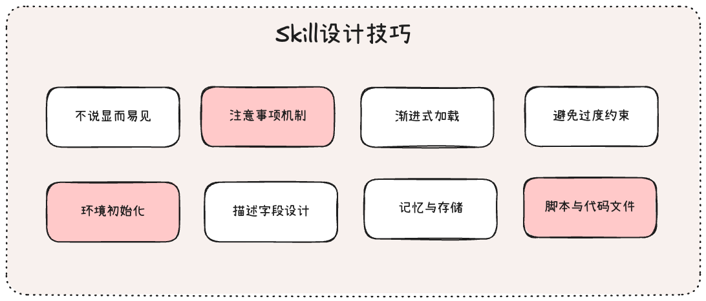

# 构建ClaudeCode的经验教训：我们如何运用Skills

现在的Skill的生态已经非常好了，很多Agent都开始支持Skill加载，不过我发现有一些Agent对于Skill的支持仅仅是渐进式披露这种方式，而不支持代码执行和Bash命令执行，那么Skill的价值其实是没有完全发挥出来的，就像这句话说的

> 对于Skills，我们经常听到的误解是它们“只是Markdown文件”，但技能最有趣的部分在于它们不仅仅是文本文件，它们是文件夹，里面可以包含脚本、资源、数据等，Agent可以发现、探索并操作这些内容

我觉得Skills规范最有魅力的地方，最有趣的地方，在于两点：

1. 渐进式披露的能力
2. 执行脚本的能力

所以在设计和使用Skills的时候，要考虑这两点能力的存在，只有这样才会借助Skills规范极大的发挥Agent的能力，不仅仅是单一方面的能力支持

参考分析资料：

- 文章链接：https://x.com/trq212/status/2033949937936085378
- 《编程Agent的工程实践：来自OpenAI与Anthropic的实战经验》：https://mp.weixin.qq.com/s/t_koiysxm-3XVsbAYWYJfw
- 《Bash工具实现和安全权限设计细节》：https://github.com/WakeUp-Jin/Practical-Guide-to-Context-Engineering

## 一、Skill类型

Anthropic团队在ClaudeCode中广泛使用Skill，其中目前活跃使用状态的Skill有数百个，对于这些Skill大致可以分为九个大类：



**1、库与API参考**：这类Skill主要说明如何正确使用库、cli、SDK。其中也包含团队内部库，

例如：

- `skills/billing-lib-skill` — 你的内部计费库，包括库的边界情况、易错陷阱等
- `skills/internal-cli `— 内部的cli工具的子命令以及使用场景

**2、产品验证**：这类Skill描述的是如何进行测试或如何验证代码是否运行正常，一般来说这个通常是前端的界面交互式验证，会使用到的外部工具是：Playwright、tmux等之类的，

例如：`skills/signup-dirver` — 项目的注册流程验证指导，以及注册过程中遇到的错误情况说明

**3、数据获取与分析**：指导Agent如何访问内部数据库，或者如何通过内部监控平台的API获取对应的数据，

例如：`skills/cohort-compare `— 比较两个用户群体的留存率或转化率，同时标记出来显著的差异

**4、业务流程与团队自动化**：将重复性工作流程自动化为一键执行的命令的Skill，设计这类Skill的时候，最关键的是要保留一些开发和执行日志，这样有助于模型根据这些结果进行统计和整理

例如：`skills/weekly-recap` — 根据合并的PR和完成的功能，定时自动整理周回顾

**5、代码脚手架与模版**：这类Skill可以为代码库的特定功能生成模版代码，或者初始化功能框架代码

例如：`skills/create-app`— 初始化自定义的服务端模版，权限验证，部署配置等

**6、代码质量与审查**：在团队开发流程中强制执行代码审查和代码质量检查的Skill

例如：`skills/testing-pratices` — 关于如何编写测试以及测试内容的指导

**7、CI/CD与部署**：帮你在代码库中获取、推送和部署代码的Skill

例如：`skills/babysit `— 监控合并PR，并自动解决流水线运行时出现的分支合并冲突。

**8、事故处置手册**：这类Skill主要是接收一个日志警报或者Bug反馈讨论，通过多种工具调查流程，最终生成一个结构化的分析报告

例如：`skills/log-correlator` — 从日志服务中提取对应的请求执行部分日志

**9、基础设施运维**：执行日常维护和操作流程的Skill

例如：`skills/cost-investigation`：服务器成本调查，存储费用之类的

上面这九种类型的skill，从开发和运维的角度来统计：前面六点是开发相关的skill，可以提升开发效率的，后面三点主要是服务器部署运维相关的，以此确保服务器运行稳定

<hr/>

对于上面分类归纳出来的Skill，有一些值得我们重点整理，接下来是对于几种的详细解释和梳理

### 1.1、库与API参考

这类Skill在创建的时候，通常是包含两个主要的内容：**参考代码片段文件夹和问题清单**

```text
.claude/skills/
└── billing-lib/
    ├── SKILL.md  # 问题清单列表
    └── snippets/ # 代码片段文件夹
        ├── create-invoice.ts
        └── refund-flow.ts
```

### 1.2、产品验证

这类Skill主要是验证代码是否正常运行，在前端开发中比较常见，一般会使用playwright来进行自动化交互测试

在openai团队的博客中，也重点设计了这一部分的内容：

> 随着Codex编写代码的速度加快，整个项目的限制节点变为了人工质量检查的部分，
> 为了加快这一节点的操作，OpenAI团队使用Chrome DevTools协议集成给Codex，让Codex可以拥有处理DOM快照，屏幕截图和导航的能力，这让Codex直接拥有分析UI的能力

在设计产品自动化验证的skill的时候，可以考虑一个小技巧：**录制测试过程或测试截图**，保存到本地，用于人工进行审查和回顾测试流程

具体的实现方式，可以借助相应的外部工具库的功能，在skill编写中添加代码示例：

```typescript
import { chromium } from 'playwright';

const browser = await chromium.launch();
//1、录制视频保存到指定位置
const context = await browser.newContext({
    recordVideo: {
      dir: './test-results/videos/',
      size: { width: 1280, height: 720 }
    }
});

//2、测试结果截图保存
const page = await context.newPage();
await page.screenshot({ path: './results/01-loaded.png' });
```

### 1.3、CI/CD与部署

该Skill主要是帮助你在代码库中拉取，推送和部署的操作流程，

其中关于`babysit-pr`这个例子非常有意思，中文翻译就是：临时照看pr，

**这种情况会极大的发生在高效的团队进行AI Native开发的流程中。因为团队会高速进行PR的提交和main分支的构建，**

例如：你提交了一个PR到main分支中去，在等待合并的过程中，另外一位开发的伙伴PR先合并进去，你这次PR就可能会出现新的冲突，需要你手动解决之后进行合并，当合并成功之后，流水线在运行的时候，有可能出现网络波动的情况，需要你手动重新运行

这个过程有时候会非常耗时，可能会拖慢整个团队的开发速度，所以你需要让claude照顾这个pr的合并构建，当PR提交有新的情况出现就自动处理，**这个处理包括：自动解决冲突，合并，重新运行流水线**

## 二、Skill构建技巧

下面是一些编写Skill的最佳实践和技巧

1. **不要陈述“显而易见”的内容**：要专注于哪些能够推动模型跳出常规思维的信息，例如：frontend design skill的设计就很好
2. **建立“注意事项”部分**：它是基于Claude在使用该Skill的时候遇见的常见失败点来书写的，这是一个会不断更新迭代的内容部分
3. <b>利用文件系统与渐进式加载：</b>对于Skill的使用，要按需动态加载，这是Skill的核心设计之一
4. **避免过度约束模型**：为模型提供一些约束的时候，条件层面要适当的放松，让模型可以根据具体的场景灵活调整
5. **执行环境的初始化设置**：有一些Skill是需要一些环境变量加载到上下文，才可以执行成功的，那么在skill书写的时候，要注意初始化流程，告知Claude如何读取到这个key，最佳的实践方案是，有一个config.json文件，里面存放一些环境配置
6. **描述字段是为模型准备的**：这个字段不要书写skill的总结，而是书写什么时候触发该skill的说明
7. **记忆和数据存储**：Skill可以通过在内部存储数据来包含某种形式的内存。您可以将数据存储在简单的仅追加文本日志文件或 JSON 文件中，也可以存储在复杂的 SQLite 数据库中
8. **存储代码脚本文件**：可以考虑书写一些代码文件放入到Skill文件夹中去，一些Agent是可以实时生成代码并且执行的，这样可以简化很多流程

一张图来总结一下吧：


