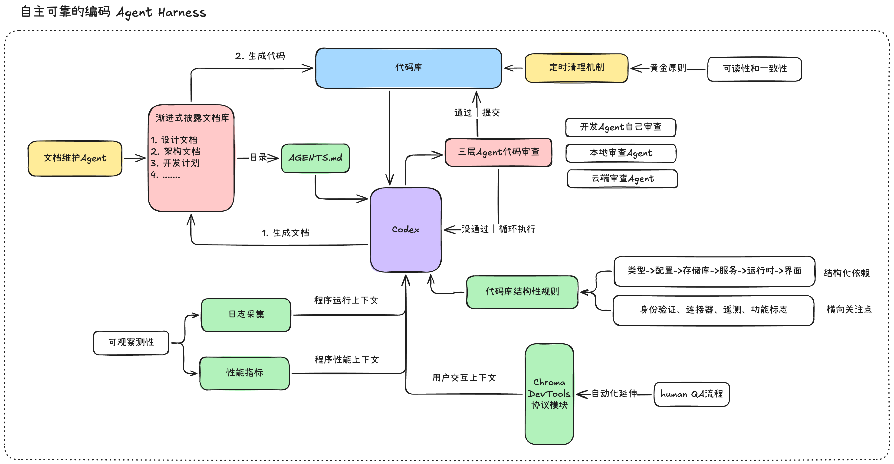
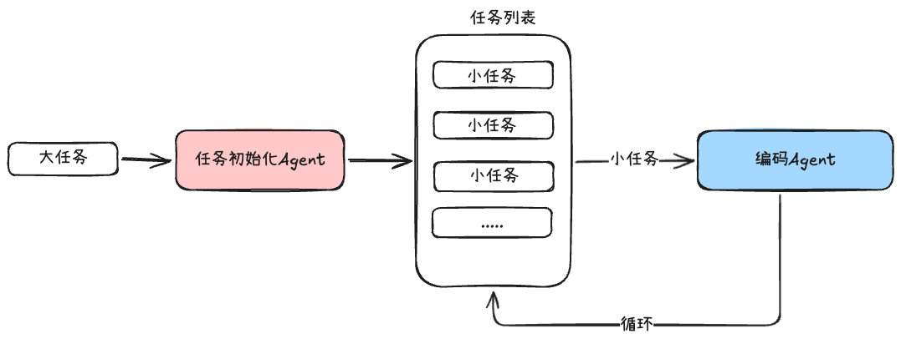
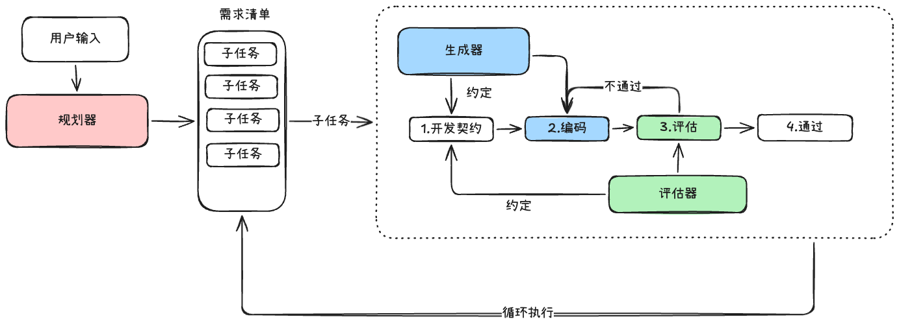
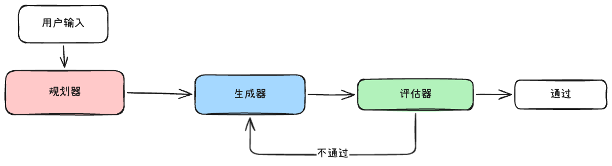

# 编程Agent的工程实践：来自OpenAI与Anthropic的实战经验

相关的链接：
- OpenAI的文章：：https://openai.com/zh-Hans-CN/index/harness-engineering/
- Anthropic的文章：https://www.anthropic.com/engineering/harness-design-long-running-apps

## 一、OpenAI的实战经验

OpenAI团队在尝试的一项实验是：**构建并发布一个内部测试版的软件产品，该产品没有使用任何手动编写的代码**

需要完成这项任务，团队要为Codex构建出来一个可以长期可靠运行的Agent Harness，也就是说软件工程团队主要工作不再是编写代码，**而是设计环境，明确意图并构建反馈循环**

让Codex可以在几周的时间内交付百万行代码的项目，并且这个项目已经被数百名内部用户使用

> 说明该项目不仅仅是为了短时间内堆积代码量，而是希望可以让用户正常使用并被认可的

我梳理了一下这个编码Agent运行空间(Harness)内的核心板块和输入的上下文

Excalidraw文件：https://my.feishu.cn/file/RTMtb9XEEoVgdhxVZuEcoPPnnnc

🌴 **第一步：三层代码审查**

工程团队最早注意到的就是代码审查的模块，在Codex完成需求之后，要指示Codex完成三层代码审查，

三层审查分别是：自身审查，本地代码审查Agent、云端代码审查Agent，

只有所有的审查都通过之后才可以进行下一步，否则就借助相应的工具，将审查结果这类上下文再次注入回Codex进行修改

🌴**第二步：人工质量检查(Human QA)**

随着Codex编写代码的速度加快，整个项目的限制节点变为了人工质量检查的部分，

为了加快这一节点的操作，OpenAI团队使用Chrome DevTools协议集成给Codex，让Codex可以拥有处理DOM快照，屏幕截图和导航的能力，这让Codex直接拥有分析UI的能力

🌴**第三步：日志检测和性能优化**

OpenAI团队同时也将运行日志和性能指标这类上下文也输入给Codex，

这样当出现“性能优化的任务时”，Codex可以拥有相应的上下文进行分析，以此来合理优化项目中的性能问题，而不是仅仅靠对于代码结构的感知，Codex可以实践 -&gt; 观察-&gt;修改

🌴**第四步：代码文档库的构建**

一个代码库的详细文档是非常庞大的，不能一次注入给Codex，这样上下文的利用会非常低效，借助Skill规范中的“渐进式披露”的概念，对于整个文档库，采用目录-文件的形式传递给Codex

OpenAI团队非常巧妙的使用AGENTS.md当作文档库的目录，里面存放相应的文档路径和简单的介绍

将是否读取和读取什么完全交给Codex来决定，在这种设计下，上下文的利用会非常高效，那么文档库也可以发挥编码指导的作用

具体的文档库细节：OpenAI团队将计划文档作为“一等公民”，还可以有设计文档，架构文档，质量文档

里面有一个很重要的细节，一个项目中的功能需求实现，是可能会经过团队成员进行讨论确定的，如果这份“讨论信息”没有被落到文档库中给Codex读取，这类代码库原本拥有的上下文在Agent的运行空间中就是不存在的

那么Codex获取到的信息是不完整的，极可能在长期的运行中偏离正确方向

所以对于这类“决策信息”，要创建相应的工具让Codex可以获取到，这也是OpenAI该团队的设计目标

代码结构在不断的变化，那么文档库是需要经常更新和维护的，所以OpenAI团队在流程中设计了定时维护文档的功能节点，实现方式也非常的简单，就是运行一个相应的“文档维护”Agent来扫描和清理文档

🌴**第五步：代码库结构性规则**

这一部分是一些代码库的规范，用于保证代码库不会随着时间推移变得混乱和失控，这仅仅依靠上面的文档库是无法完全做到的，文档库对于Codex更多的是引导作用，而这一步的结构性规则偏向于约束作用

例如：当Codex要增加一个功能的时候，先从什么地方开始增加，要考虑哪一层的结构，这个依赖于顺序规则

**类型-&gt; 配置 -&gt; 存储库 -&gt; 服务-&gt; 运行时-&gt;用户界面**

该规则的校验方式是依赖于自定义的代码检查器的执行（这个代码检查器也是由Codex编写的）

代码检查器执行的时候，会检查到代码库中的编写错误，该工具会将错误信息传递给Codex

**🍺 一点总结**

从这个实践中可以发现，OpenAI团队在将**成熟的软件工程开发经验**用于构建编码领域的Agent运行空间中去，正如他们说的那样：

> 显而易见的是：软件开发仍然需要严谨的纪律，但这种严谨更多地体现在框架搭建而非代码本身。用于保持代码库一致性的工具、抽象和反馈循环变得越来越重要

所以对于构建长期稳定运行的Agent，**最大的挑战其实是：设计环境，反馈回路和控制系统，而解决方案我们可以从这些实践中总结出来一些**

1. 对于Agent完成任务中的任何步骤，需要提供执行反馈的功能，以此将执行结果输入给Agent，实现反馈回路
2. 从一般规律中找特殊，如果该Agent需要服务于具体的场景，那么约束控制是有效的
3. 为Agent提供更多的有效上下文，在其运行环境中，最佳实践目前是“文档渐进式加载”

## 二、Anthropic的实战经验

Excalidraw文件：https://my.feishu.cn/file/DUTrbXJmyo9KzvxcfHxcV6uZnbh

在构建能够支持编码智能体长时间运行框架的时候，Anthropic团队使用的是**任务初始化Agent+编码智能体**的简单的两层多智能体架构设计，随着运行时间的增加和任务的复杂度提升，出现了两种常见的故障模式：

1. 随着上下文窗口逐渐填满，模型会失去连贯性，同时部分模型还会表现出“上下文焦虑”，尤其是Sonnet 4.5
2. 在设计自我评估的模块时，当要求Agent评估自己生成的作品时，其往往会自信的给予高度赞扬，这很容易导致评估模块失效

🌴 对于第一个问题，Anthropic团队的解决方法是：**上下文重置**

完全清除上下文（不仅仅是依赖上下文压缩），并启动一个新的Agent，同时配合结构化的交接机制（该机制会传递前一个Agent的状态和后续步骤）

🌴对于第二个问题，**将评估任务使用的Agent与执行任务使用的Agent分开**

也就是说不要在同一个Agent中即赋予任务执行，也赋予任务评估，虽然这种分离本身不能立即消除“评估宽容”

> “评估宽容”：评估Agent依旧是一个LLM，它会倾向于对LLM的生成的输出给予较高的评价

这种分离的方式，是目前最有效的解决方法啦，至少可以有效降低评估与执行集中在同一Agent中所带来的失效风险

接下来，Anthropic团队在原有框架的基础上，再次进行了改进，构建了一个三种Agent的系统

Excaildraw文件：https://my.feishu.cn/file/Il4pbOFgHoHtInxGe7icQupcnHf

1. 规划器：它能够接收 1-4 句话的简单提示，并将其扩展为完整的产品规格说明。我要求它在范围方面设定得更远大一些，并专注于产品背景和高层技术设计，而不是具体的实现细节
2. 生成器：以循环执行的方式工作，每次从需求清单中选取一个子任务执行
3. 评估器：使用 Playwright MCP 模拟用户操作，逐个点击运行中的应用程序，测试 UI 功能、API 端点和数据库状态，**并且基于一套标准进行评分**

这套设计中有很核心的两点实践经验可以借鉴：

- **在每次子任务执行前，生成器和评估器会一起协商一份开发契约：在编写任何代码之前，就这一部分工作的完成标准达成一致**，之所以有开发契约是因为在规划器书写需求清单的时候，是有意写的比较概括的，Anthropic团队希望通过这一步来弥合用户需求和可测试之间的差距
- **🌟 Agent之间的通信使用文件来进行**，一个Agent写入一个文件，另外一个Agent读取该文件，响应内容也可以写入该文件，通过文件的读取写入来进行通信

关于上面提到的评估器的标准的构建，Anthropic的方式也非常值得学习

团队要为前端的实现进行评估，大家知道美学是无法完全使用分数来衡量的，每个人的品味都不一样，一千个读者眼中就有一千个哈姆雷特

Anthropic给出的解决方案是:

> 我们可以通过编码设计原则和偏好的评分标准来提升设计水平。“这个设计美观吗？”很难给出一致的答案，但“它是否符合我们对优秀设计的原则？”则为 Claude 提供了一个具体的评分标准

也就是说，问题从“这个设计漂亮吗？”，变为了“这个设计符合我们的设计原则吗？”，举一个例子：

- 问“这篇文章写得好吗？”，这个很难回答，因人而异
- 问“这篇文章是否结构清晰、论据充分、语言流畅”，这种情况下就有了具体的评估标准

**🌟 将“模糊的主观判断”变为“可操作的评分标准”**

Anthropic团队关于前端设计标准分为四项

1. 设计质量：设计是否感觉像是一个连贯的整体，而不是各个部分的简单堆砌？优秀的设计意味着色彩、字体、布局、图像和其他细节相互融合，共同营造出独特的氛围和风格
2. 原创性：是否存在自定义决策的痕迹，还是仅仅使用了模板布局、库默认设置和人工智能生成的图案？一位优秀的设计师应该能够识别出精心设计的创意。未经修改的现成组件——或者像白色卡片上叠加紫色渐变这样的人工智能生成痕迹——都无法体现原创性
3. 工艺：技术执行：排版层级、间距一致性、色彩和谐、对比度。这考察的是能力，而非创意。大多数合理的实现方式默认都能达标；失败则意味着基本功薄弱
4. 功能性：可用性独立于美观性之外。用户能否理解界面功能，找到主要操作，并在不猜测的情况下完成任务？

对于Claude模型来说，其本身在工艺和功能性上面表现就非常出色，我们应该注重设计质量和原创性

Anthropic团队对于这个框架不断的进行迭代，最终的方案为：

Excaildraw文件：https://my.feishu.cn/file/MIJwbZldkowQE2xOOGlcQuhenZf

因为模型的升级，最终方案使用的是Opus4.6，所以之前的设计方案有一些被移除啦

1. 移除任务拆分的功能，不需要小任务多次循环执行，Opus4.6完全可以处理这种任务整体执行
2. 移除了开发契约的功能，评估器直接看最终产物，不需要进行开发协商

**🍺 总结：对于Harness的设计，不会是一成不变的，随着模型基础能力的提升，整个Harness是需要做删减和增加的。**

> **一个Agent的优化，不仅是改变模型型号这么简单，而是一些相应的工具和模块会成为模型的阻碍点，是需要删除的，**

**当然对于Harness的组合设计空间并不会缩小，它会不断的扩展，而大模型应用开发工程师真正的乐趣或许在于不断寻找下一个新颖的组合**

## 三、从开发Agent角度思考Harness

1、要构建Agent的审查模块，Agent的输出都可以经过审查模块，如果审查不通过就将审查结果注入回上下文，继续执行Agent，直到审查结果通过，审核模块的Agent最好和执行Agent分开，是两个完全不同的上下文环境

2、Agent之间的消息传递或者工具和Agent之间的消息传递，可以考虑简单有效的方法，使用md格式的文件来传递消息，发出消息的Agent写入文件，收到消息的Agent读取文件

3、审查模块的Agent是需要一份“审查规范”的，也就是说什么情况下执行Agent的结果是通过的，这份规范里面包含评判标准和通过条件，

就像老师批改试卷一样，每个老师都有一份相同的评分标准存在，同时考试及格的条件是60分，

关于这份审查规范的创建是开发者的任务之一，开发者要主动将主观的判断标准转变为客观的，就像Anthropic博客中说的一样，不要纠结于“这个结果好不好”，而是专注于“好的结果标准是什么”，这个标准就是审查Agent需要的审查规范

4、要学会简单有效的原则去构建Agent，对于构建出来的Harness要明白它是动态的，随着模型能力的升级是会不断调整的，学会去感知模型升级给你构建的Harness会带来什么样子的变化，这里可以使用Agent评估这一方法去辅助你感知，而不是仅仅依靠你的感觉

5、目前最佳的多智能体的核心架构设计方案，或许是：**规划-执行-评估**