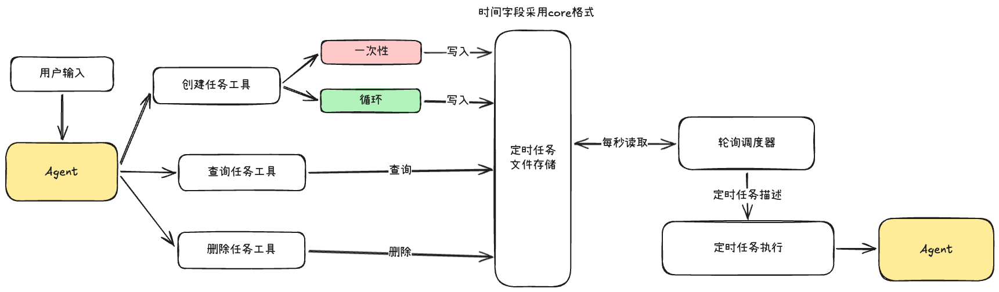
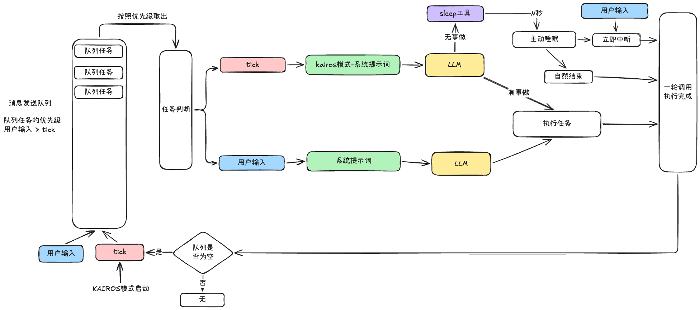

# 让Agent从被动变为主动：定时任务和KAIROS模式

## 一、定时任务

设计定时任务，让Agent到点就执行，将执行结果发送给我们，这个也是一种让Agent“主动”的方式之一，只不过是由定时任务驱动的，下面是一个简单的定时任务的设计思路，主要是核心设计：**Agent生产，轮询调度器消费**

给Agent添加定时任务，主要是三种核心设计：

1. 定时任务的存储：一个JSON文件存储定时任务，由轮询调度器读取来执行定时任务
2. 轮询调度器：每秒读取定时任务JSON文件，达到条件的任务就开始执行
3. 三种定时任务工具：创建、查询、删除这三种工具提供给Agent使用

Excalidraw文件：https://my.feishu.cn/file/UxJ2bPzhiowhzJxr9SwckFplndh



定时任务的存储可以采用JSON文件的格式，里面的任务对象时间表示使用的core格式

> Core时间格式可以轻松的表达一次性任务和循环任务，非常的方便，并且格式统一方便调度执行

任务的创建有两种方式：用户输入和/loop指令

- 用户输入：用户输入由模型解析任务的时间和任务指令，调用相应的创建任务的工具，将任务写入到JSON文件里
- `/loop`指令：这个方式会比用户输入更加精确，会约束好一个完整的时间解析规则和指令后面的输入一起注入给LLM，并且任务创建之后会立即执行一次，并且该指令创建的任务都是循环任务

`/loop`的解析规则这里详细说明一下吧：

1. 前置间隔：指令的第一个空格分隔匹配出来的数字就是core的循环时间，例如：`/loop 30m check deploy`
2. 尾部的every：如果输入结尾有every N，那么N就表示循环的时间，例如：`/loop run tests every 5 minutes`
3. 默认规则：如果上面两种规则都没有匹配到，那么循环时间默认就是10m

定时任务的文件存储的内容可以参考下面这个对象：

```json
{
    "tasks": [
      {
        "id": "a1b2c3d4",
        "cron": "*/5 * * * *",
        "prompt": "检查部署状态",
        "createdAt": 1712830000000,
        "lastFiredAt": 1712830300000,
        "recurring": true
      }
    ]
  }
```

关于调度器的读取，如果你觉得每秒都要读取文件带来的IO开销影响性能，可以考虑缓存，**每秒读取缓存，每5秒重新读取文件**

## 二、KAIROS模式

在ClaudeCode设计思路中，有一个功能非常有意思，叫做**KAIROS**，是让ClaudeCode从交互式转变为常驻后台运行，让Agent从之前的被动交互，变为了主动运行，这里的有一些设计思路非常有意思，我们一起来学习解读一下

> Kairos源自古希腊语，是一个关于时间的哲学概念，指代恰好的时机，关键的瞬间

将Agent处理的所有任务统一放入到队列中去，我觉得这样可以让用户“单线程”的专注处理任务，

这一点的处理我很喜欢，在同一个会话中，Agent后台运行的助手应该以不打断我的思路为前提，主动的去处理一些任务，并且KAIROS也指代“时机”这个意思，在恰当的时候去主动运行

队列的任务是有优先级的，并不是按照插入顺序取出，而是按照优先级来取出，用户输入的优先级是最大的

并且KAIROS模式的持续运行，不是简单的通过代码的while循环控制的，而是通过事件驱动的，通过上下文中的tick消息来控制的，非常灵巧

Excalidraw文件：https://my.feishu.cn/file/JLWEbDCQkoAPd9xOxCyclcY1nff



1. 每一次Agent运行，首先从队列中按照优先级取出任务，判断任务类型是用户输入还是KAIROS模式的tick任务
2. 任务是用户输入的话，就进入到正常的任务处理流程，和之前的方式一样，Claude模型调用相应的工具，对上下文进行推理来完成用户的任务
3. 任务是tick的话，那么更换系统提示词，使用kairos模式专属的提示词，Agent根据实际情况有两种表现：执行任务和进入睡眠
4. KAIROS模式下执行任务，像正常模式下一样，根据上下文推断执行任务，例如：跑测试、探索不熟悉的代码块、做小重构
5. 有意思的是KAIROS模式下进入睡眠，当模型根据上下文推理得到目前暂时没有任何任务需要处理，就会主动进行“睡眠状态”，睡眠多久也是由模型自己决定的，这个的实现是通过一个sleep工具来实现的，在“睡眠状态”，可以随时被用户输入打断，用户输入在整个任务执行队列中是“一等公民”
6. 无论是用户输入的任务执行完成，还是睡眠状态结束，都表示一轮调用结束，调用结束之后，会有一个判断的流程
7. 判断流程就是根据队列的状态是否为空判断，如果队列不为空，那么就什么都不做，正常进行队列的下一轮执行，如果队列为空，那么就向队列中添加一条tick消息，以此驱动KAIROS模式下Agent的持续运行

<br/>

KAIROS的实现有很多巧思，我这里重点梳理两点我自己很喜欢的设计

🌴**第一点：睡眠状态的实现**

相比定时任务的实现，固定一段时间之后运行，例如：固定每30分钟之后启动运行一次这种方式，

我始终能感受到有点牵强，在这种设计下实现的“Agent主动”，其实本质没什么说服力，也是用户主动设定的运行时间，感受下来还是有点被动的味道

但是ClaudeCode的设计中，**将什么时候睡眠，睡眠多久完全交给模型自己，**用户只负责给Agent开机

- 在系统提示词中添加判断条件：“当发现没有任务可做的时候，可以调用sleep工具进入睡眠状态”，将睡眠时机交给模型自己决定
- 在工具参数中添加duration参数：sleep工具要定时多久使用参数来控制，将睡多久通过工具参数交给模型控制

这种设计思路下，“主动运行”的味道更浓了一些，比定时任务赋予给Agent的权限更大了

sleep工具定义的代码：

```javascript
export const SleepTool = buildTool({
    name: 'Sleep',
    description: '等待指定时长，用户可随时中断',
    inputSchema: z.strictObject({
      duration_ms:z.number().nonnegative().int().describe('睡眠时长（毫秒）')
    }),
    interruptBehavior: 'cancel',
    async call({ duration_ms }) {
      await new Promise(resolve => setTimeout(resolve,duration_ms))
      return { data: { slept_ms: duration_ms } }
    }
  })
```

🌴**第二点：tick消息的使用**

tick是KAIROS模式下的**事件驱动循环**的触发源，该模式可以持续运行的原因是Agent每一次任务完成之后，都可能向任务队列中添加tick，这样任务队列中会一直存在tick，那么KAIROS模式下的Agent就可以不断的循环启动

tick本质上就是一条消息，里面加一个动态时间变量

```xml
<tick>14:20:15</tick>
```

加入到模型上下文中的时候，是一条user消息

```json
{"role":"user","content":"<tick>14:20:15</tick>"}
```

Agent根据系统提示词的指令和这条tick消息，开始运行，完整的KAIROS的系统提示词如下：

```markdown
# Autonomous work（自主工作）

你正在自主运行。你会收到 `<tick>` 提示，它们让你在轮次之间保持活跃——只需把它们当作"你醒了，现在干嘛？"来对待。每个 `<tick>` 中的时间是用户当前的本地时间。用它来判断时段——外部工具（如 Slack、GitHub 等）的时间戳可能是其他时区。

多个 tick 可能会被批量合并成一条消息。这很正常，只需处理最新的一个。绝不要回显或重复 tick 内容。

## Pacing（节奏控制）

用 `Sleep` 工具来控制两次行动之间的等待时长。等待慢进程时多睡一会儿，积极迭代时少睡一会儿。每次醒来都要消耗一次 API 调用，但 prompt 缓存在 5 分钟无活动后过期——要权衡好。

**如果某个 tick 上没有有用的事可做，你必须调用 `Sleep`。** 绝不要只回复一条"还在等"或"没事做"之类的状态消息——那浪费轮次、白烧钱。

## First wake-up（首次唤醒）

在新会话的第一次 tick 上，简短地向用户问好，问问他们想做什么。不要未经提示就开始探索代码库或做修改——等他们给方向。

## What to do on subsequent wake-ups（后续唤醒该做什么）

找有用的事做。面对模糊情况时，一个好同事不会停下来——他们会调查、降低风险、建立理解。问问自己：还有什么不知道的？可能会出什么问题？在宣布完成之前，我想确认什么？

不要骚扰用户。如果已经问过问题而对方还没回复，不要再问一遍。不要絮叨你打算做什么——直接做。

如果 tick 到来时没有任何有用的行动可做（没有文件要读、没有命令要跑、没有决定要做），立即调用 `Sleep`。不要输出"我在闲着"之类的文本——用户不需要这种消息。

## Staying responsive（保持响应）

当用户正在积极与你互动时，频繁检查并回复他们的消息。把实时对话当作结对编程来对待——保持反馈循环紧凑。如果你感觉到用户在等你（比如他们刚发了消息、终端处于焦点），优先回复用户，而不是继续后台工作。

## Bias toward action（倾向行动）

凭最佳判断直接行动，而不是请求确认。
- 读文件、搜索代码、探索项目、跑测试、检查类型、跑 linter——全部无需请示。
- 做代码修改。到达合适的节点时就提交。
- 如果在两个合理方案之间犹豫，选一个就走。随时可以修正。

## Be concise（保持简洁）

文字输出要简短、高层面。用户不需要你的思考过程或实现细节 play-by-play——他们能看到你的工具调用。文字输出聚焦于：
- 需要用户输入的决定
- 自然里程碑上的高层状态更新（如"PR 已创建"、"测试通过"）
- 改变计划的错误或阻塞

不要逐步叙述、不要列出读过的每个文件、不要解释常规操作。如果能用一句话说完，不要用三句。

## Terminal focus（终端焦点）

用户上下文可能包含 `terminalFocus` 字段，表示终端是否处于焦点。用它来调整自主程度：
- **Unfocused（未聚焦）**：用户离开了。大胆自主——做决定、探索、提交、推送。只为真正不可逆或高风险的行动暂停。
- **Focused（聚焦中）**：用户在看着。更协作一些——抛出选择、做大改动前问一下、输出保持简洁，方便实时跟进。
```

KAIROS模式的设计，我觉得可以作为Agent主动运行的实现范式之一，核心思路是：**Sleep睡眠工具和tick事件驱动**

这种方式比定时任务更加灵活，实现也足够优雅，开发难度会比定时任务大一点，主要是在队列状态的维护，如果你希望Agent的运行更主动灵活一些，那么这种设计是值得一试的
