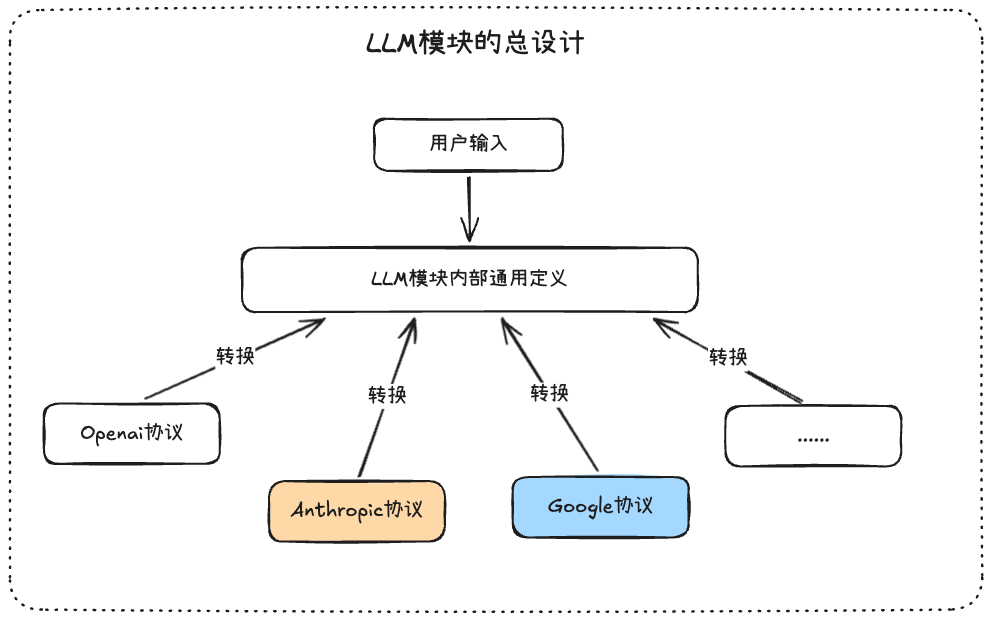
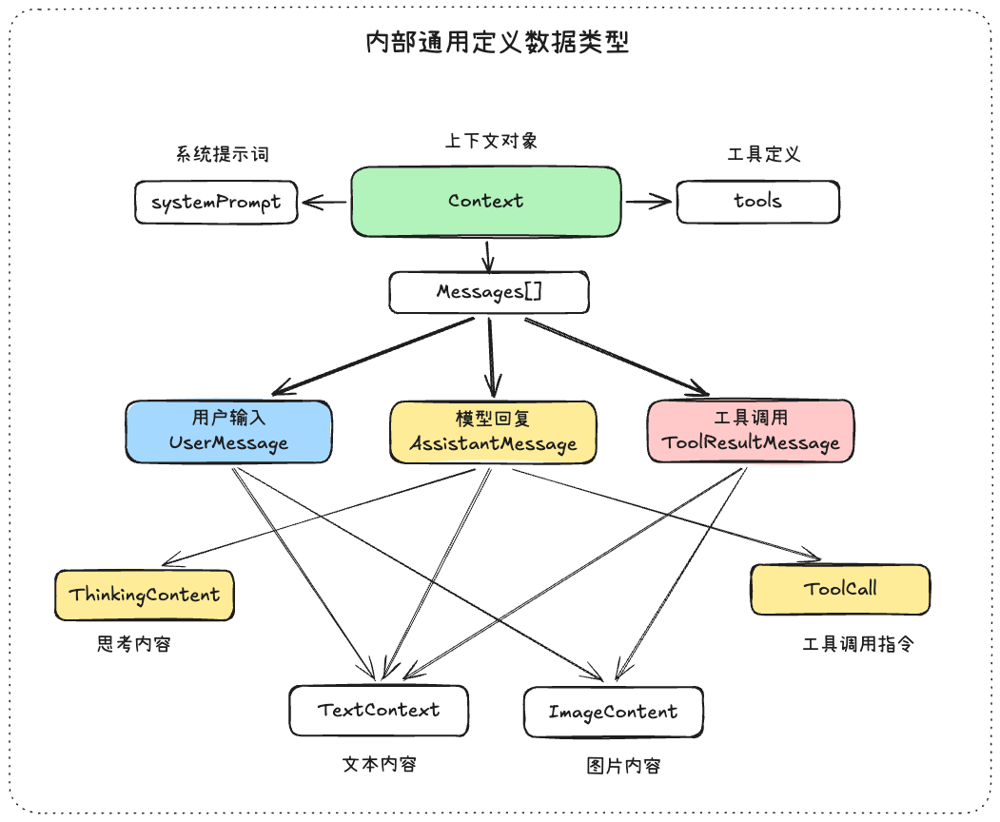
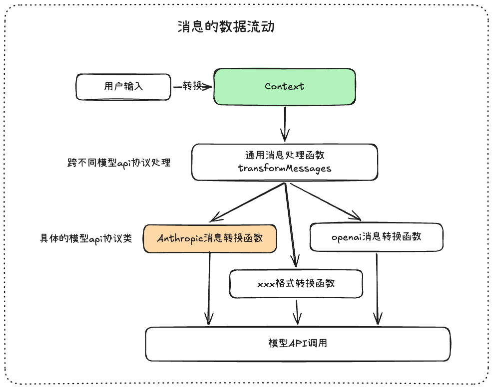
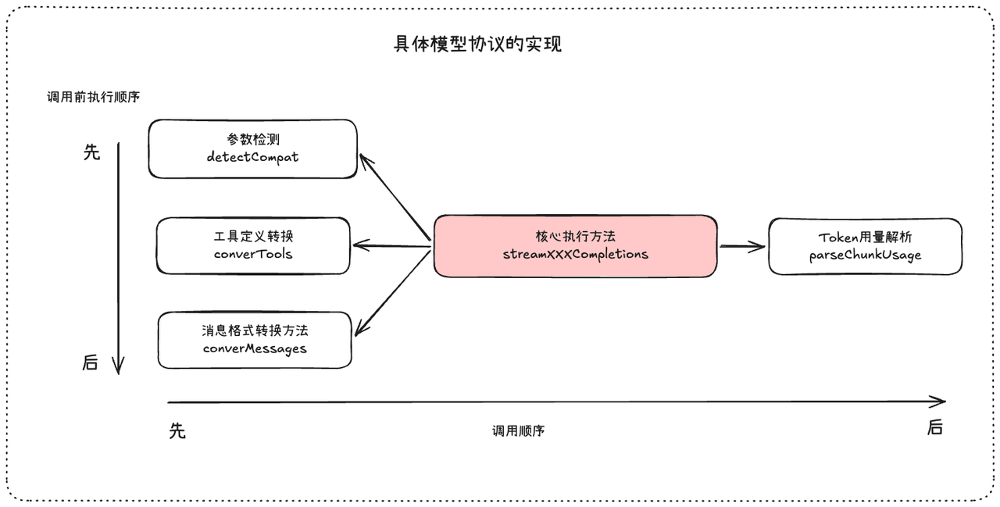
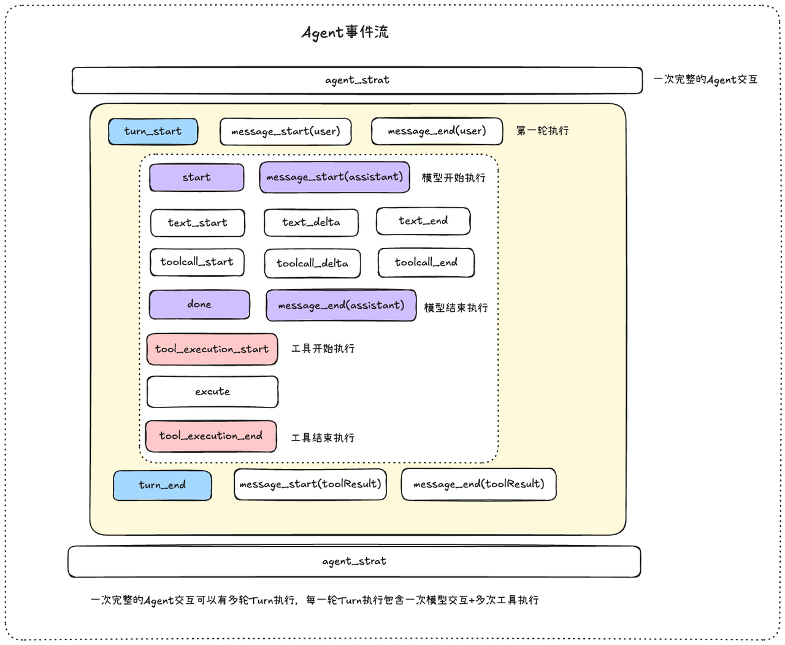
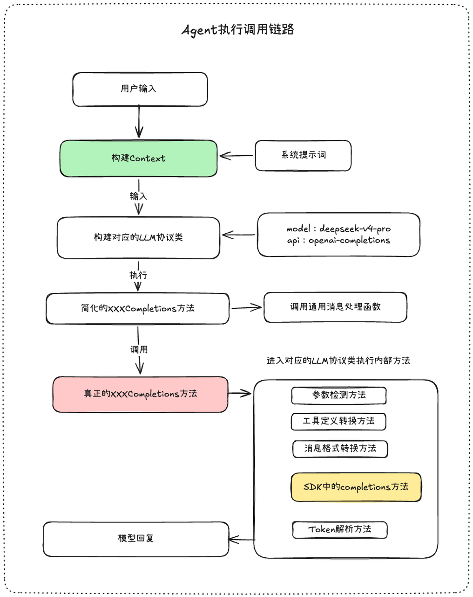

# 学习和整理Pi的LLM模块设计
PI这个项目中，对于LLM模块的设计，尤其是多供应商的设计是比较出色的，还有它的模型配置文件的字段设计和对于上下文的理解都很不错，在设计层面是考虑到上下文的重要性的。

和我文章最后提到的开源项目：「大模型应用开发 - 上下文工程与运行空间实践指南」中定位是一样的，Context在目前的大模型应用工程中依旧很重要，并且在优化的阶段，是harnss工程调整的原则之一

Pi非常值得我们花时间去整理和学习，这也是kimi-code和openclaw的构建基础框架之一

相关资料和博客：

- PI的LLM模块核心包：https://github.com/earendil-works/pi/tree/main/packages/ai

- 《我构建一个固执己见且极简的编码代理所学到的东西》：https://mariozechner.at/posts/2025-11-30-pi-coding-agent/#toc_1

- 《停止将聊天历史用作智能体的状态存储》：https://blog.raed.dev/posts/agentic-workflows-are-not-conversations/

- 我让Agent对Agent事件流的学习编写了一个可视化的html文件，辅助理解Agent事件流：https://my.feishu.cn/file/DDCQbPjHooCTsrxNaxbcb7F0nFh

- 文章完整的五张Excalidraw的思维图文件：https://my.feishu.cn/file/IAxabBIfdosBhPxkKQicxJP7n5d

- 完整的Context类型文件：https://my.feishu.cn/file/CHF6bIwRyoAYs8x2lkwcI43gnkl

## 一、LLM模块的总设计



PI的编码Agent是支持多种供应商和模型的，并且在会话中途是可以更换模型和供应商的，如何协调不同的协议和消息格式是PI的核心模块`pi-ai`的设计初心，我们可以一起来从全局的角度来理解

1. PI定义自己内部通用的消息类型，用户发送的任何消息都会先转换为这种通用的格式，作为消息流通的核心

2. 用户在输入的时候，会传递供应商和模型进来，根据这个我们就可以得到用户想要调用的具体的协议，那么通用定义就会先经过转换为相关协议的类型，然后调用模型，模型回复也会被转换为通用的类型，下一次用户输入的时候，切换了模型，依旧进行目标协议的转换

重点理解就是：无论怎么做，无论有多少模型和供应商，无论有多少种api协议，**只要关注自己内部定义好的通用格式就可以啦，到真正使用的时候，进行临时转换**

接下来我们一起看看这个内部通用定义的东西是什么？长什么样子？

## 二、LLM模块内部通用定义



在一个成熟的Agent的Loop中，消息会有不同的角色，角色可以让消息列表有流程循环的状态，常见的消息角色：`user、assisant、toolResult`，下面是一个完整的Context对象的例子

```TypeScript
const context: Context = {
    systemPrompt: "你是...",
    tools: [],
    messages: [
      // userMessage
      { role: "user", content: "北京今天天气怎么样？"},
      // assistantMessage
      {
        role: "assistant",
        content: [
          { type: "thinking", thinking: "...", thinkingSignature:"eyJhbGciOi..." },
          { type: "text", text: "让我帮你查一下。" },
          { type: "toolCall", id: "call_01ABC", name:"get_weather", arguments: { city: "北京" } },
        ],
        ...assistantMessage,
      },
      // toolResultMessage
      {
        role: "toolResult", toolCallId: "call_01ABC", toolName:"get_weather",
        content: [{ type: "text", text: "晴，25°C，东北风 3 级"}],
        ...toolResultMessage,
      },

      // assistantMessage
      {
        role: "assistant",
        content: [{ type: "text", text: "北京今天晴朗，25°C，适合外出！"}],
        ...assistantMessage,
      },

      // 多模态的userMessage
      {
        role: "user",
        content: [
          { type: "text", text: "这张图里的数学题帮我算一下：" },
          { type: "image", data: "iVBORw0KGgo...", mimeType:"image/png" },
        ],
        ...userMessage,
      },
    ],
  };
```


内部流通的是Context，并且你可以向Context中增加一些数据状态，文章《停止将聊天历史用作智能体的状态存储》中有详细的介绍，感兴趣的开发者可以去仔细阅读一下，我感觉重点一句是：

> 你的应用拥有结构化状态：当前用户、选中项目、流程位置、数据库数据。而 LLM 只有一维消息数组。两者持续产生偏差，最终只能由你来调和。
> 
> 当你把对话数组当作事实来源时，就是在强迫表现层数据结构承担控制流的职责。当状态发生偏移（这不可避免），调试意味着需要通读消息数组，推断智能体在第 4 步时认为的状态是什么。没有其他办法。这种扁平化模型抹杀了所有结构。
> 
> 


所以内部使用Context对象来作为通用消息格式，并且可以增加一些字段未来可以用来表示状态和承担控制流的职责，

当要将上下文注入给相应的模型的时候，这个时候可以进行临时的格式转换以适配对应的模型api协议，这样未来增加任何供应商和模型的时候，只要增加对应的转换函数就可以，其他的都不用改动，**所以Context是所有消息的源头**

## 三、消息的数据流动

接下来我们一起来看看Context是如何转换为对应模型的消息格式的，设计层面非常有意思，很值得学习



**🎃 通用消息处理函数**：一般这里**会编写异常工具消息的处理和错误/中止消息的过滤**，让即将传入给模型的消息看起来健康一些

> 异常工具消息表示的是：在message变量中，工具的调用时需要成双成对的，不能单一出现，不然调用会报错的
> 
> 

这里可以理解成为复用函数，共同逻辑编写的地方，例如：有一个逻辑是每一个模型协议都要有的，你如果写在具体的协议类里面去，那么需要重复7\-8份一模一样的代码片段，但是你写到这里，只写一次，

并且会在进入到真正的相应转换函数之后，会执行这个逻辑，很方便，有点全局函数的感觉


🎃 **消息转换函数**：这个就非常好理解啦，就是将Context里面的消息转换为对应的供应商的格式，具体的格式大家可以去看官方文档

## 四、具体的LLM协议类的实现

具体的API协议类的实现，例如：anthropic的实现，openai\-completions的实现，google的实现，核心就是五个方法，其他的都是辅助函数

> 对辅助函数感兴趣的可以看源码,，抽取四个核心方法出来是因为好理解，理解的负担不大，同时可以抓住主要核心理解，不至于淹没到一堆的胶水代码和兼容代码中
> 
> 



1. 参数检测：根据传入的模型和供应商自动检测哪些参数是被支持，是可以使用的，例如：开启思考的方式deepseek和openai是不一样的

2. 工具定义转换：将tools转换为目标LLM协议支持的格式，例如：Openai和Anthropic的工具定义的方式是不同的，需要转换

3. 消息格式转换：将Context中的通用格式转换为目标的LLM协议支持的格式，一般来说就是系统提示词的放置

4. parseChunkUsage：从模型输出的结果中解析出来对应的Token，输入、缓存、输出，总计

5. streamXXXCompletions：核心执行方法，里面会执行上面四个封装好对应逻辑的函数，同时调用相应的SDK完成调用任务

在核心执行方法中，有一个重要的工具函数，我们在调用模型的时候，是开启了流式输出的，如何向用户层面提供流式输出和非流式输出两种调用方法，就来源于这个工具函数的设计

## 五、核心工具类

这个工具类Event\-Steam写的非常好，我想完整的把代码展示出来：

```TypeScript

export class EventStream<T, R = T> implements AsyncIterable<T> {
    private queue: T[] = [];
    private waiting: ((value: IteratorResult<T>) => void)[] = [];
    private done = false;
    private finalResultPromise: Promise<R>;
    private resolveFinalResult!: (result: R) => void;

    constructor(
        private isComplete: (event: T) => boolean,
        private extractResult: (event: T) => R,
    ) {
        this.finalResultPromise = new Promise((resolve) => {
            this.resolveFinalResult = resolve;
        });
    }

    push(event: T): void {
        if (this.done) return;

        if (this.isComplete(event)) {
            this.done = true;
            this.resolveFinalResult(this.extractResult(event));
        }

        // Deliver to waiting consumer or queue it
        const waiter = this.waiting.shift();
        if (waiter) {
            waiter({ value: event, done: false });
        } else {
            this.queue.push(event);
        }
    }

    end(result?: R): void {
        this.done = true;
        if (result !== undefined) {
            this.resolveFinalResult(result);
        }
        // Notify all waiting consumers that we're done
        while (this.waiting.length > 0) {
            const waiter = this.waiting.shift()!;
            waiter({ value: undefined as any, done: true });
        }
    }

    async *[Symbol.asyncIterator](): AsyncIterator<T> {
        while (true) {
            if (this.queue.length > 0) {
                yield this.queue.shift()!;
            } else if (this.done) {
                return;
            } else {
                const result = await new Promise<IteratorResult<T>>((resolve) => this.waiting.push(resolve));
                if (result.done) return;
                yield result.value;
            }
        }
    }

    result(): Promise<R> {
        return this.finalResultPromise;
    }
}
```

1. queue和waiting的设计：一个是从生产端角度设计的，如果这个时候消费端没有准备好，那么使用queue队列保存住，但是这样消费端在取的时候，就要不断的循环拿数据，一个是从消费端角度设计的，如果生产端在推送数据的时候，消费端已经准备好啦，那么直接推送给消费端，不需要中间队列存储，速度快，资源消耗低

2. result方法和Generator函数：一个是异步生成器，消费端可以await的方式流式取数据，一个是堵塞住，等待模型输出完成之后，返回给对应的变量

## 六、事件流和调用链路

### 6\.1、Agent执行事件流



一次完整的Agent事件流，里面会存在Agent生命周期，turn执行，消息输入，模型执行，工具执行，终止和错误这些状态存在，梳理清楚这些状态会非常有益于我们做执行日志记录和前端的执行显示

**🌴**在理解Agent事件流中，一定要记住**：一次Agent交互，会存在多轮模型的调用（也就是多个turn），每一轮模型的调用都有模型的回复，模型的回复中如果有工具调用执行，那么这一轮还会有工具执行的流程存在**


下面是详细的Agent事件类型的设计代码，可以参考：

```TypeScript
export type AgentEvent =
  // Agent 生命周期
  | { type: "agent_start" }
  | { type: "agent_end"; messages: AgentMessage[] }
  // Turn 生命周期
  | { type: "turn_start" }
  | { type: "turn_end"; message: AgentMessage; toolResults: ToolResultMessage[] }
  // 消息生命周期
  | { type: "message_start"; message: AgentMessage }
  | { type: "message_update"; message: AgentMessage; assistantMessageEvent: AssistantMessageEvent }
  | { type: "message_end"; message: AgentMessage }
  // 工具执行生命周期
  | { type: "tool_execution_start"; toolCallId: string; toolName: string; args: any }
  | { type: "tool_execution_update"; toolCallId: string; toolName: string; args: any; partialResult: any }
  | { type: "tool_execution_end"; toolCallId: string; toolName: string; result: any; isError: boolean };
  
export type AssistantMessageEvent =
  | { type: "start";         partial: AssistantMessage }
  | { type: "text_start";    contentIndex: number; partial: AssistantMessage }
  | { type: "text_delta";    contentIndex: number; delta: string; partial: AssistantMessage }
  | { type: "text_end";      contentIndex: number; content: string; partial: AssistantMessage }
  | { type: "thinking_start";  contentIndex: number; partial: AssistantMessage }
  | { type: "thinking_delta";  contentIndex: number; delta: string; partial: AssistantMessage }
  | { type: "thinking_end";    contentIndex: number; content: string; partial: AssistantMessage }
  | { type: "toolcall_start";  contentIndex: number; partial: AssistantMessage }
  | { type: "toolcall_delta";  contentIndex: number; delta: string; partial: AssistantMessage }
  | { type: "toolcall_end";    contentIndex: number; toolCall: ToolCall; partial: AssistantMessage }
  | { type: "done";  reason: "stop" | "length" | "toolUse"; message: AssistantMessage }
  | { type: "error"; reason: "aborted" | "error"; error: AssistantMessage };
```


### 6\.2、Agent执行链路

在LLM模块的总设计思路下，Agent执行调用链路的完整情况如下，从用户输入到要触发的LLM模块的核心地方



总结下来就是两点：

1. 根据模型定义好的api变量的值，来现在要实例化哪一个LLM模块协议类

2. 根据选择好的LLM模块协议类，进行参数的转换和消息格式的转换，让模型调用可以成功执行


