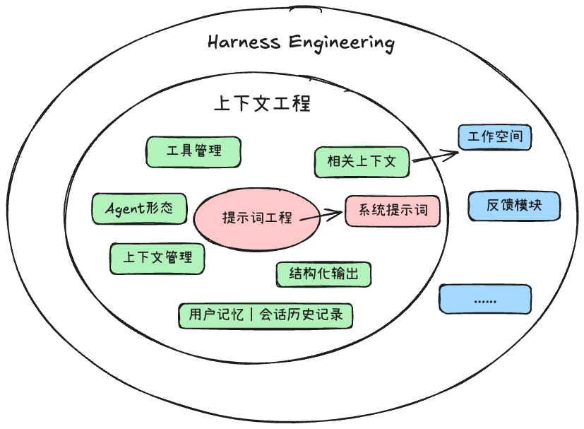
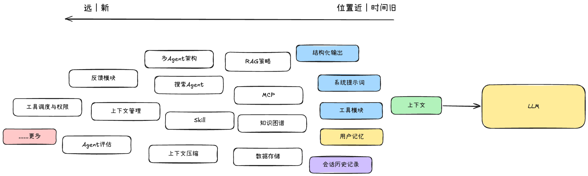

## 项目介绍
&emsp;&emsp; 随着大语言模型（LLM）的快速发展，越来越多的开发者和企业尝试将其应用到实际业务场景中。然而，在真实落地的过程中，大家很快发现：模型本身并不是一切，决定模型表现的关键在于它所拥有的上下文。

&emsp;&emsp;上下文工程（Context Engineering）正是在这样的背景下提出的一种系统化方法论。它关注如何在有限的上下文窗口中，选择、组织并注入与用户任务高度相关的信息，从而让大模型在合理的边界内做出最佳推理与执行。

&emsp;&emsp;Harness Engineering 则是更进一步，它不仅关注上下文，更关注 Agent 的稳定运行，它为 Agent 搭建了完整的运行空间，设计了它的能力结构、协作机制和反馈闭环，让它在特定领域里稳定地产生高质量结果

本项目的目标，是为开发者和研究者提供一份大模型应用开发的骨架思路，以上下文组成作为大模型应用开发的核心，有关大模型应用开发的技术都可以互相联系起来

### 阅读路径

本文档按照以下脉络组织，建议按顺序阅读：

1. **全局认知** — 先理解上下文工程与 Harness Engineering 两个核心概念，建立全局地图
2. **大模型应用开发基础技术** — 为"相关上下文"服务的基础技术：RAG、搜索代理、向量存储、知识图谱
3. **上下文核心模块** — 从上下文类型出发，逐一了解每种上下文衍生出的工程模块（主体部分，篇幅最大）
4. **上下文管理** — 当所有模块都往上下文窗口里塞东西时，如何裁剪、压缩、协调？
5. **Agent 运行空间** — 超出上下文工程范围的 Agent 运行需求：形态设计、评估反馈
6. **实践与案例** — 真实项目中的落地经验

> 如果你的团队在做大模型应用或 Agent 相关的产品，欢迎找我聊聊。微信：`a2385472291`、email：2385472291@qq.com

## ✏️什么是上下文工程
**上下文工程的定义：是在有限的上下文窗口中，选择、组织并注入与用户输入或任务高度相关的信息，从而让大语言模型（LLM）能够在合理的边界内做出最佳推理和执行。**

上下文工程中最关键的是：**用最相关的信息填充 LLM 的上下文窗口**

如何为“用户输入”找到最相关的信息，是这个上下文工程系统的入口，也是衡量整个系统价值的核心指标，但这种“相关性”的实现并不会自然而然发生，它依赖开发者去设计、构建与优化整个系统

与 RAG 的区别是：RAG 是上下文工程中的一个子集

与提示词工程的区别是：提示词工程是专注于 LLM 最前置的正确指令艺术，其主要是：在单个文本字符串中设计完美的指令集

>  Karpathy的总结：人们通常将提示与日常使用中向 LLM 提供的简短任务描述联系起来。但在每个工业级 LLM 应用中，上下文工程是一门微妙的艺术和科学，它通过为下一步提供恰到好处的信息来填充上下文窗口。这是科学，因为正确地做到这一点涉及任务描述和解释、少量示例、RAG、相关（可能是多模态的）数据、工具、状态和历史记录、压缩等。太少或形式不正确，LLM 就没有正确的上下文来优化性能。太多或太不相关，LLM 的成本可能会上升，性能可能会下降。做好这一点非常不简单。而且，这也是艺术，因为围绕 LLM 心理和人们精神的指导直觉。
>

Karpathy的总结的链接：[https://x.com/karpathy/status/1937902205765607626?ref=blog.langchain.com](https://x.com/karpathy/status/1937902205765607626?ref=blog.langchain.com)

## ✏️什么是Harness Engineering
Harness Engineering我的理解是：**为Agent搭建运行空间，设计它的能力结构、协作机制和反馈闭环，让它在特定领域里稳定地产生高质量结果**

它不是只做限制模型能做什么的，而是在创造条件让模型能做到原本做不到的事。**这个运行空间要随着模型的升级逐渐变化**。

所以大家更多应该去关注不同领域下，这个Agent的运行空间是如何构建的。

## ✏️上下文工程和Harness Engineering的关系

:palm_tree: **1、从概念范围来看：上下文工程是Harness Engineering的子集**

Harness Engineering中有些模块是直接服务于上下文（RAG、记忆、系统提示词），有些是间接服务上下文(上下文管理，Agent评估)，有些则是直接服务于Agent稳定运行的
但无论在哪一层，它们都在Harness Engineering这个大框架下

> 越靠近中心，越直接操作上下文。越靠近外层，越偏向基础设施

:palm_tree: **2、从技术发展来看：这条演进路径有一条清晰的主线： 上下文 -> 上下文工程 -> Harness Engineering**

最早，我们只关注"塞给模型什么内容"，这是上下文本身的问题。随着需求复杂化，开始系统性地管理上下文的构建方式，于是有了上下文工程。而当 Agent 承担起更复杂的任务，单靠上下文管理已经不够，我们需要为它搭建完整的运行环境——Harness Engineering 由此出现。

> 它不是替代，而是一次扩展，每一个阶段都在前一个阶段基础上，往外多包了一层

:sunny: **上下文工程是设计原则，Harness Engineering 是建造目标**