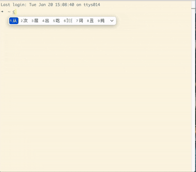

# 前言
从之前我整理的上下文工程实践指南出发，我大概梳理出来，在一个 Agent 中最核心的模块我分为四类：

1. **工具模块和管理**：定义一些 Agent 的工具，可以是 MCP，也可以是 Skill，除了定义之后，我们还需要管理：工具的输出裁剪，工具的执行审核流程等
2. **上下文管理**：这个是启动 Agent 的关键，整理好注入给 LLM 的上下文是完成任务的关键，其中重要的是：上下文的压缩、上下文的裁剪等，同时 Agent 上下文会遇到：上下文污染、上下文干扰、上下文冲突、上下文混淆的问题，这些问题需要开发者结合系统工程的方式来解决
3. **LLM 模块**：这个是 Agent 真正的核心，就像钢铁侠的“方舟反应堆”一样
4. **Agent 形态（执行器**）：这个是 Agent 的执行形态，目前可以是工作流、可以是单智能体、可以是多智能体等各种形态

> 上下文工程实践指南仓库链接：[https://github.com/WakeUp-Jin/Practical-Guide-to-Context-Engineering](https://github.com/WakeUp-Jin/Practical-Guide-to-Context-Engineering)
>


🪐 借助这四点核心的思路，我开发了一个模块版本（比较简单），可以借助脚手架的方式安装使用，

主要是让大家查看代码文件和文件之间的结构，以此对借助上下文工程的思路开发一个 Agent 有更清晰的感觉

cli 项目链接：[https://github.com/WakeUp-Jin/context-cli-template](https://github.com/WakeUp-Jin/context-cli-template)

启动命令：

```shell
npm create context-template
```

<!-- 这是一张图片，ocr 内容为： -->



# 一、总设计
Excalidraw 文件：[https://gcntfv628ebr.feishu.cn/file/YAS4b3tgIoapG4xQlRecBv09nLb](https://gcntfv628ebr.feishu.cn/file/YAS4b3tgIoapG4xQlRecBv09nLb)

<!-- 这是一张图片，ocr 内容为：工具定义和输出 会话历史记录 系统提示词 结构化输出 用户输入 用户记忆 相关上下文-块文档 上下文管理函数 上下文管理 工具定义 工具参数设计 工具 管理 AGENT形态(执行器) 工具模块和管理 工具执行-控制流 函数 工具类型 LLM模块 LLM工厂函数-创建具体的LLM实例 OPENAI DEEPSEEK CLAUDE -->
.png)

整个后端架构设计中，是按照上下文工程来做的设计，上下文管理是核心，它就是一个完整的大输入，以此输入作为前提，来解决用户的问题

1. LLM 模块：是使用 **openaiSDK** 来实现的多种型号模型的使用，这里是提供模型的
2. 工具模块和管理：工具是 LLM 关键的外部能力，是结合到上下文来让 LLM 使用的
3. 上下文管理：这个是统一的上下文，其负责编排好上下文，在 执行器中将上下文输入给 LLM，以 LLM 的输出来解决问题

# 二、LLM 模块
Excalidraw 文件：[https://gcntfv628ebr.feishu.cn/file/B5SobRCKIo865wxZoAEcz8PAnGb](https://gcntfv628ebr.feishu.cn/file/B5SobRCKIo865wxZoAEcz8PAnGb)


.png)

关于 LLM 模块，整个模块的分为：

+ LLM 创建工厂函数：根据传入的参数来判断实例化哪一个 LLM 服务类
+ LLM 服务类：要编写一个相应的 LLM 服务类，里面有三种方法：complete 方法、simpleChat 方法、generate 方法，其中最重要的是 complete 方法，这个会作为上下文输入的核心方法


目录情况结构：

```plain
- llm
  - services
    - DeepSeekService.ts // 这个就是具体的LLM服务类
    - DoubaoService.ts
  - utils
  - types
    - index.ts //这个是整个llm模块的类型约束
  - factory.ts //LLM工厂函数
  - index.ts
```


举一个例子：

```typescript
//具体使用

//1、使用工厂函数实例化相应的LLM类
const service = await createLLMService({
  provider: 'deepseek',
  model: 'deepseek-chat',
  apiKey: process.env.DEEPSEEK_API_KEY || 'your-api-key-here',
  maxIterations: 5,
});

//2、调用simpleChat方法
const answer = await service.simpleChat(
  '用一句话解释什么是大语言模型？',
  '你是一个有帮助的 AI 助手'
);

//3、调用complete方法
let message=[//...]
let tools=[//...]
const response=await service.complete(message,tools)

```

参考文档在上下文工作实践指南中：
- [LLM模块-服务层的设计](../LLM模块/LLM服务层的实现设计.md)
- [LLM模块-Cipher的LLM 服务架构分析文档 -TS版本](../LLM模块/Cipher的LLM%20服务架构分析文档%20-TS版本.md)


# 三、工具模块和管理
.png)

工具模块主要的三个点就是：

1. 工具的定义：定义一个工具对象需要哪些属性
2. 提供给 LLM 工具参数：可以是 tools 参数，也可以是提示词文本
3. 工具的执行函数：工具的执行函数


**目录结构：**

```plain
- tool
  - FileReadTool
    - FileReadTool.ts //工具定义
    - prompt.ts //工具描述
  - GrepTool
    - GrepTool.ts
    - prompt.ts
  - index.ts
  - ToolManager.ts //工具管理函数
  - types.ts //工具模块的类型
```


**1、 工具定义**

```typescript
/**
 * 工具定义基础接口
 */
export interface InternalTool<TArgs = any, TResult = any> {
  /** 工具名称(唯一标识) */
  name: string;

  /** 工具分类(如 filesystem、search、network) */
  category: string;

  /** 是否为内部工具 */
  internal: boolean;

  /** 工具描述(简短,详细描述在 prompt 中) */
  description: string;

  /** 版本号 */
  version: string;

  /** 参数定义(JSON Schema 格式) */
  parameters: ToolParameterSchema;

  /** 工具处理函数 */
  handler: (args: TArgs, context?: InternalToolContext) => Promise<TResult>;

  /** 可选:格式化结果给 AI */
  renderResultForAssistant?: (result: TResult) => string;

  /** 可选:权限控制 */
  needsPermissions?: (input?: TArgs) => boolean; // 是否需要权限
  isEnabled?: () => Promise<boolean>; // 是否启用
  isReadOnly?: () => boolean; // 是否只读
  isConcurrencySafe?: () => boolean; // 是否并发安全
}
```


例如：

```typescript
//1、创建工具管理器
const toolManager = new ToolManager();

//2、获取工具定义
const tools = toolManager.getTools();

//3、创建LLM服务
const llm = await createLLMService(
  {
    provider: 'deepseek',
    model: 'deepseek-chat',
    apiKey: config.apiKey || '',
    maxIterations: 5,
  },
  tools
);

//4、调用工具执行函数
const answer = await llm.generate(
  '请帮我读取 package.json 文件，并告诉我项目名称是什么'
);
```
参考文档在上下文工作实践指南中：
- [工具模块-工具管理](../工具管理模块/工具管理.md)
- [工具模块-ClaudeCode逆向工程（Kode）的工具定义和管理 -TS版本](../工具管理模块/ClaudeCode逆向工程（Kode）的工具定义和管理%20-TS版本.md)

# 四、上下文管理
Excalidraw 文件：[https://gcntfv628ebr.feishu.cn/file/KbH8bMIgbo9TzNxn9zdc7FeMnce](https://gcntfv628ebr.feishu.cn/file/KbH8bMIgbo9TzNxn9zdc7FeMnce)

.png)

在这种上下文管理设计中，将该 Agent 中所有种类的上下文管理统一起来，让 LLM 只需要直接和上下文输入联系


🌟🌟 在这种开发模式下，开发的重心在上下文的获取和整理，但是应用的关键核心是 LLM。

+ 保证核心是 LLM，后续就可以根据模型能力的提升，Agent 的效果也变得越来越好。
+ 开发重心是上下文，可以极大的发挥应用开发者的能力和创造力


**目录结构：**

```plain
- context
  - base
    - BaseContext.ts //基础上下文类
  - modules
    - ConversationContext.ts //上下文 - 会话历史记录类
    - MemoryContext.ts //上下文 - 用户记忆类
    - StructuredOutputContext.ts //上下文 - 结构化输出类
    - SystemPromptContext.ts //上下文 - 系统提示词类
    - ToolContext.ts  //上下文 - 工具管理类
  - ContextManager.ts //上下文管理器
  - index.ts
  - types.ts // 上下文管理模块的类型约束
```

参考文档在上下文工作实践指南中：
- [上下文管理模块-提示词文档](../上下文管理/上下文管理.md)
- [上下文管理模块-Token压缩策略](../上下文管理/Token压缩策略.md)
- [上下文管理模块-上下文压缩：ClaudeCode、Gemini与工具消息裁剪](../上下文管理/上下文压缩：ClaudeCode、Gemini与工具消息裁剪.md)


# 五、执行器
关于执行器的详细文档在上下文工程实践指南中：
- [Agent形态-智能体系统构建策略-单智能体和多智能体](../Agent形态/智能体系统构建策略-单智能体和多智能体.md)
- [Agent形态-两种世界的交互形态：协同Agent与自主Agent](../Agent形态/两种世界的交互形态：协同Agent与自主Agent.md)


