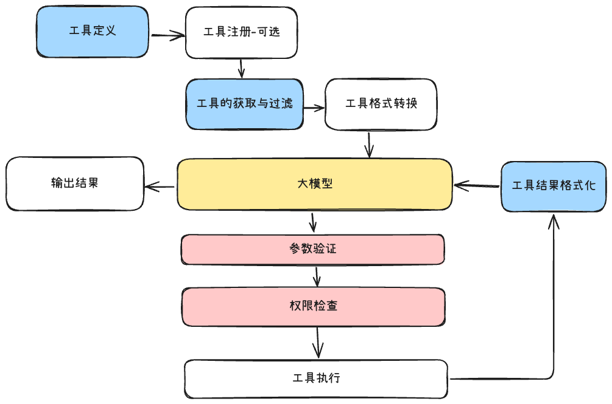

# ClaudeCode逆向工程（Kode）的工具定义和管理 -TS版本

本文档详细介绍 Kode 项目中工具系统的定义规范和管理机制。
**🤖 本文档是由AI大模型整理，作为工具模块Ts版本的实现具体的参考**

---

## 一、工具定义（Tool Interface）

工具定义位于 `src/Tool.ts`，所有工具必须实现 `Tool` 接口。

### 1.1 基础属性

#### `name: string`
- 工具的唯一标识符
- 用于工具查找和调用
- 示例：`"GrepTool"`, `"FileReadTool"`, `"BashTool"`

#### `description: () => Promise<string>`
- 异步函数，返回工具的详细描述
- **用途**：向 AI 模型说明工具的功能和使用场景
- **特点**：支持异步加载，可以根据环境动态生成
- 示例：
  ```typescript
  async description() {
    return "Search for patterns in file contents using regular expressions"
  }
  ```

#### `inputSchema: z.ZodObject<any>`
- Zod Schema 对象，定义工具的输入参数结构
- **用途**：
  - 参数验证
  - 类型安全
  - 自动生成 JSON Schema 供 AI 模型使用
- 示例：
  ```typescript
  const inputSchema = z.strictObject({
    pattern: z.string().describe('搜索的正则表达式模式'),
    path: z.string().optional().describe('搜索目录，默认为当前目录')
  })
  ```

#### `inputJSONSchema?: Record<string, unknown>`
- 可选，直接提供 JSON Schema 格式的参数定义
- 如果提供，优先使用此项而不转换 `inputSchema`
- 用于兼容 MCP 工具或自定义 Schema

#### `prompt: (options?: { safeMode?: boolean }) => Promise<string>`
- 返回工具的系统提示词
- **参数**：
  - `safeMode`：安全模式标志，可调整提示内容的详细程度
- **用途**：提供更详细的工具使用指导给 AI

#### `userFacingName?: () => string`
- 可选，返回面向用户的友好名称
- 示例：`"Search"` (而不是 `"GrepTool"`)

---

### 1.2 状态检查方法

#### `isEnabled: () => Promise<boolean>`
- 异步检查工具是否启用
- **用途**：动态控制工具可用性
- 示例场景：
  - 检查依赖是否安装
  - 检查配置是否完整
  - 检查 Feature Flag 状态

#### `isReadOnly: () => boolean`
- 判断工具是否为只读操作
- **影响**：只读工具可以并发执行，提高效率
- **只读工具示例**：`FileReadTool`, `GrepTool`, `GlobTool`
- **非只读工具示例**：`FileEditTool`, `BashTool`

#### `isConcurrencySafe: () => boolean`
- 判断工具是否支持并发执行
- **区别**：比 `isReadOnly` 更细粒度
- 某些只读工具可能因为其他原因不支持并发

---

### 1.3 权限控制

#### `needsPermissions: (input?: z.infer<TInput>) => boolean`
- 判断工具执行是否需要用户授权
- **参数**：可选的输入参数，用于根据具体操作判断
- **示例**：
  ```typescript
  needsPermissions(input) {
    // 修改系统文件需要权限，读取不需要
    return input?.file_path.startsWith('/etc/')
  }
  ```

#### `validateInput?: (input, context?) => Promise<ValidationResult>`
- 可选的自定义验证逻辑
- **执行时机**：在 Zod Schema 验证通过之后
- **返回值**：
  ```typescript
  {
    result: boolean,      // 验证是否通过
    message?: string,     // 错误消息
    errorCode?: number,   // 错误码
    meta?: any           // 附加信息
  }
  ```

---

### 1.4 核心执行方法

#### `call: (input, context) => AsyncGenerator<Result, void, unknown>`
- 工具的核心执行逻辑
- **类型签名**：
  ```typescript
  call(
    input: z.infer<TInput>,
    context: ToolUseContext
  ): AsyncGenerator<
    { type: 'result'; data: TOutput; resultForAssistant?: string },
    void,
    unknown
  >
  ```

- **参数**：
  - `input`：已验证的输入参数
  - `context`：执行上下文，包含：
    - `messageId`：消息 ID
    - `agentId`：Agent ID
    - `safeMode`：安全模式标志
    - `abortController`：中止控制器
    - `readFileTimestamps`：文件时间戳记录
    - `options`：其他选项（工具列表、模型配置等）

- **返回值**：异步生成器，支持流式输出
  - 可以 yield 多次，实现进度更新
  - 最终 yield 包含 `type: 'result'` 的结果对象

- **示例**：
  ```typescript
  async *call({ pattern, path }, { abortController }) {
    // 执行搜索
    const results = await search(pattern, path, abortController.signal)
    
    // 返回结果
    yield {
      type: 'result',
      data: { matches: results },
      resultForAssistant: `Found ${results.length} matches`
    }
  }
  ```

---

### 1.5 渲染方法

#### `renderResultForAssistant: (output: TOutput) => string`
- 将工具输出格式化为 AI 可读的字符串
- **用途**：作为工具结果返回给模型继续对话
- **要求**：清晰、结构化、包含关键信息

#### `renderToolUseMessage: (input, options) => string`
- 渲染工具调用时的消息
- **参数**：
  - `input`：工具输入参数
  - `options`：包含 `verbose` 标志
- **用途**：向用户展示工具正在执行的操作

#### `renderToolUseRejectedMessage: () => React.ReactElement`
- 渲染工具被拒绝时的 UI 组件
- **用途**：用户拒绝授权时显示友好提示

#### `renderToolResultMessage?: (output: TOutput) => React.ReactElement`
- 可选，渲染工具执行结果的 UI 组件
- **用途**：向用户展示结构化的执行结果

---

### 1.6 类型参数

`Tool` 是泛型接口，支持两个类型参数：

```typescript
interface Tool<
  TInput extends z.ZodObject<any> = z.ZodObject<any>,
  TOutput = any
>
```

#### `TInput: z.ZodObject<any>`
- 输入参数的 Zod Schema 类型
- 默认值：`z.ZodObject<any>`
- **作用**：提供类型安全的输入参数推断

#### `TOutput: any`
- 工具执行结果的类型
- 默认值：`any`
- **作用**：定义工具返回数据的结构

**示例**：
```typescript
const GrepTool = {
  // ...
} satisfies Tool<
  typeof inputSchema,
  {
    durationMs: number
    numFiles: number
    matches: Array<{ file: string; line: number; content: string }>
  }
>
```

---

## 二、工具管理系统

工具管理系统负责工具的注册、发现、过滤和生命周期管理。

### 2.1 工具注册（`src/tools.ts`）

#### 核心函数：`getAllTools()`

集中注册所有内置工具：

```typescript
export const getAllTools = (): Tool[] => {
  return [
    TaskTool as unknown as Tool,
    AskExpertModelTool as unknown as Tool,
    BashTool as unknown as Tool,
    GlobTool as unknown as Tool,
    GrepTool as unknown as Tool,
    LSTool as unknown as Tool,
    FileReadTool as unknown as Tool,
    FileEditTool as unknown as Tool,
    MultiEditTool as unknown as Tool,
    FileWriteTool as unknown as Tool,
    NotebookReadTool as unknown as Tool,
    NotebookEditTool as unknown as Tool,
    ThinkTool as unknown as Tool,
    TodoWriteTool as unknown as Tool,
    WebSearchTool as unknown as Tool,
    URLFetcherTool as unknown as Tool,
    MemoryReadTool as unknown as Tool,
    MemoryWriteTool as unknown as Tool,
  ]
}
```

**设计理念**：
- 单一注册点，便于管理
- 避免循环依赖（使用函数而非直接导出数组）
- 类型转换确保兼容性

---

### 2.2 工具获取与过滤

#### `getTools(enableArchitect?: boolean): Promise<Tool[]>`

获取所有启用的工具，支持配置过滤：

```typescript
export const getTools = memoize(
  async (enableArchitect?: boolean): Promise<Tool[]> => {
    // 1. 合并内置工具和 MCP 工具
    const tools = [...getAllTools(), ...(await getMCPTools())]

    // 2. 根据配置添加可选工具（如 ArchitectTool）
    if (enableArchitect) {
      tools.push(ArchitectTool as unknown as Tool)
    }

    // 3. 过滤未启用的工具
    const isEnabled = await Promise.all(tools.map(tool => tool.isEnabled()))
    return tools.filter((_, i) => isEnabled[i])
  },
)
```

**特性**：
- **Memoization**：使用 lodash `memoize` 缓存结果
- **动态启用检查**：调用每个工具的 `isEnabled()` 方法
- **MCP 集成**：自动加载 Model Context Protocol 外部工具
- **配置驱动**：支持通过参数启用可选工具

---

#### `getReadOnlyTools(): Promise<Tool[]>`

获取所有只读工具（用于安全模式或并发优化）：

```typescript
export const getReadOnlyTools = memoize(async (): Promise<Tool[]> => {
  const tools = getAllTools().filter(tool => tool.isReadOnly())
  const isEnabled = await Promise.all(tools.map(tool => tool.isEnabled()))
  return tools.filter((_, index) => isEnabled[index])
})
```

---

### 2.3 工具转换（AI 模型格式）

#### 在 `src/services/claude.ts` 中

将工具定义转换为 Claude API 可接受的格式：

```typescript
const toolSchemas = await Promise.all(
  tools.map(async tool => ({
    name: tool.name,
    description: typeof tool.description === 'function' 
      ? await tool.description()    // 异步获取描述
      : tool.description,
    input_schema: zodToJsonSchema(tool.inputSchema),  // Zod → JSON Schema
  }))
)
```

**关键技术**：
- **`zodToJsonSchema`**：将 Zod Schema 转换为标准 JSON Schema
- **异步描述**：支持动态生成工具描述
- **格式适配**：符合 Anthropic 的工具调用协议

**发送给 AI**：
```typescript
const response = await anthropic.messages.create({
  model: 'claude-3-5-sonnet',
  messages: conversationMessages,
  system: systemPrompt,
  tools: toolSchemas,      // ← 工具定义
  tool_choice: 'auto'      // 让 AI 自动决定是否使用工具
})
```

---

### 2.4 工具执行流程（`src/query.ts`）

#### 完整执行链路

```typescript
// 1. AI 返回工具调用请求
const toolUse = {
  type: 'tool_use',
  id: 'toolu_...',
  name: 'GrepTool',
  input: { pattern: 'logger', path: '/src' }
}

// 2. 查找对应的工具实例
const tool = toolUseContext.options.tools.find(t => t.name === toolUse.name)
if (!tool) {
  throw new Error(`Tool ${toolUse.name} not found`)
}

// 3. Zod Schema 验证输入
const isValidInput = tool.inputSchema.safeParse(toolUse.input)
if (!isValidInput.success) {
  return {
    type: 'tool_result',
    tool_use_id: toolUse.id,
    content: `InputValidationError: ${isValidInput.error.message}`,
    is_error: true
  }
}

// 4. 自定义验证（如果提供）
if (tool.validateInput) {
  const validation = await tool.validateInput(isValidInput.data, context)
  if (!validation.result) {
    return {
      type: 'tool_result',
      tool_use_id: toolUse.id,
      content: validation.message,
      is_error: true
    }
  }
}

// 5. 权限检查
if (tool.needsPermissions(isValidInput.data)) {
  const hasPermission = await canUseTool(tool, isValidInput.data, context)
  if (!hasPermission) {
    return {
      type: 'tool_result',
      tool_use_id: toolUse.id,
      content: 'Permission denied by user',
      is_error: false
    }
  }
}

// 6. 执行工具
for await (const result of tool.call(isValidInput.data, context)) {
  if (result.type === 'result') {
    output = result.data
  }
}

// 7. 格式化结果返回给 AI
const formattedResult = tool.renderResultForAssistant(output)
return {
  type: 'tool_result',
  tool_use_id: toolUse.id,
  content: formattedResult
}
```

---

### 2.5 并发控制

工具执行器会根据工具属性决定是否并发执行：

```typescript
// 检查所有待执行工具是否都是只读的
const canRunConcurrently = toolUseMessages.every(msg =>
  toolUseContext.options.tools.find(t => t.name === msg.name)?.isReadOnly()
)

if (canRunConcurrently) {
  // 并发执行所有工具
  await Promise.all(toolUseMessages.map(msg => runToolUse(msg)))
} else {
  // 顺序执行
  for (const msg of toolUseMessages) {
    await runToolUse(msg)
  }
}
```

---

### 2.6 Agent 工具过滤

不同的 Agent 可以配置使用不同的工具子集（`src/tools/TaskTool/TaskTool.tsx`）：

```typescript
// Agent 配置示例
const agent = {
  agentType: 'researcher',
  whenToUse: 'Research and analyze code',
  tools: ['GrepTool', 'FileReadTool', 'GlobTool']  // 只能用这些工具
}

// 应用工具过滤
let tools = await getTaskTools(safeMode)
if (toolFilter && toolFilter !== '*') {
  if (Array.isArray(toolFilter)) {
    tools = tools.filter(tool => toolFilter.includes(tool.name))
  }
}
```

**工具配置选项**：
- `'*'`：所有工具
- `['ToolA', 'ToolB']`：指定工具列表

---

### 2.7 MCP 工具集成

支持加载外部 Model Context Protocol 工具（`src/services/mcpClient.ts`）：

```typescript
export const getMCPTools = memoize(async (): Promise<Tool[]> => {
  // 从所有 MCP 服务器请求工具列表
  const toolsList = await requestAll<ListToolsResult>(
    ListToolsResultSchema,
    'tools/list',
    {}
  )

  // 将 MCP 工具转换为 Kode Tool 接口
  return toolsList.flatMap(({ client, result: { tools } }) =>
    tools.map((tool): Tool => ({
      ...MCPTool,
      name: `mcp_${client.name}_${tool.name}`,
      description: async () => tool.description ?? '',
      inputJSONSchema: tool.inputSchema,
      async *call(input, context) {
        // 调用 MCP 服务器执行工具
        const result = await client.callTool({
          name: tool.name,
          arguments: input
        })
        yield {
          type: 'result',
          data: result,
          resultForAssistant: JSON.stringify(result)
        }
      }
    }))
  )
})
```

**集成流程**：
1. 连接配置的 MCP 服务器
2. 请求每个服务器的工具列表
3. 转换为 Kode Tool 格式
4. 合并到工具集合中

---

## 三、完整数据流


---

## 四、最佳实践

### 4.1 定义新工具

```typescript
// 1. 定义输入 Schema
const inputSchema = z.strictObject({
  param1: z.string().describe('参数1说明'),
  param2: z.number().optional().describe('可选参数2')
})

// 2. 实现工具
export const MyTool = {
  name: 'MyTool',
  
  async description() {
    return '工具详细描述，告诉 AI 什么时候使用此工具'
  },
  
  async prompt() {
    return '系统提示词，提供使用指导'
  },
  
  inputSchema,
  
  userFacingName() {
    return '我的工具'
  },
  
  async isEnabled() {
    // 检查依赖、配置等
    return true
  },
  
  isReadOnly() {
    return true  // 如果是只读操作
  },
  
  isConcurrencySafe() {
    return true  // 如果支持并发
  },
  
  needsPermissions(input) {
    return false  // 如果不需要权限
  },
  
  async *call(input, context) {
    // 执行逻辑
    const result = await doSomething(input)
    
    yield {
      type: 'result',
      data: result,
      resultForAssistant: formatResult(result)
    }
  },
  
  renderResultForAssistant(output) {
    return `操作完成: ${output}`
  },
  
  renderToolUseMessage(input, { verbose }) {
    return `正在执行: ${input.param1}`
  },
  
  renderToolUseRejectedMessage() {
    return <Text>操作被取消</Text>
  }
  
} satisfies Tool<typeof inputSchema, MyOutputType>
```

### 4.2 注册工具

在 `src/tools.ts` 中添加：

```typescript
import { MyTool } from './tools/MyTool/MyTool'

export const getAllTools = (): Tool[] => {
  return [
    // ... 其他工具
    MyTool as unknown as Tool,
  ]
}
```

### 4.3 工具描述编写指南

- **清晰明确**：说明工具的功能和用途
- **使用场景**：告诉 AI 什么时候应该使用此工具
- **参数说明**：在 Zod Schema 的 `.describe()` 中详细说明每个参数
- **限制说明**：说明工具的限制和注意事项

---

## 五、总结

Kode 的工具系统通过以下设计实现了强大的扩展性和可维护性：

1. **统一接口**：所有工具遵循 `Tool` 接口规范
2. **类型安全**：Zod Schema 提供运行时验证和类型推断
3. **权限控制**：细粒度的权限管理和用户授权流程
4. **并发优化**：根据工具特性自动决定执行策略
5. **动态扩展**：支持 MCP 协议加载外部工具
6. **配置驱动**：Agent 可以灵活配置工具集合

这套系统为 AI 助手提供了可靠、安全、高效的工具调用能力。
