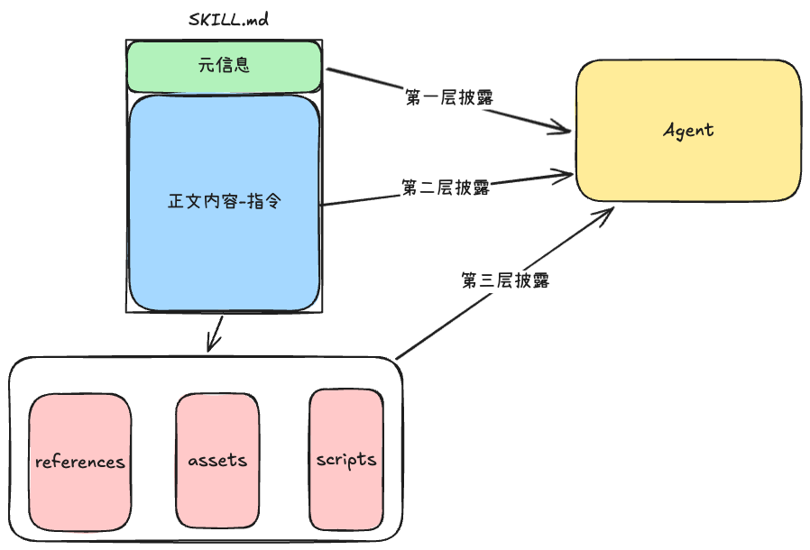
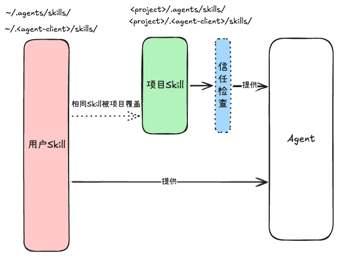
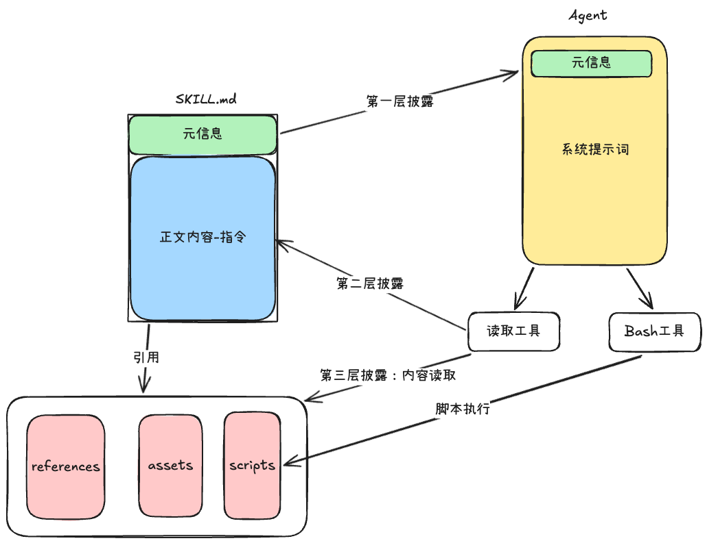
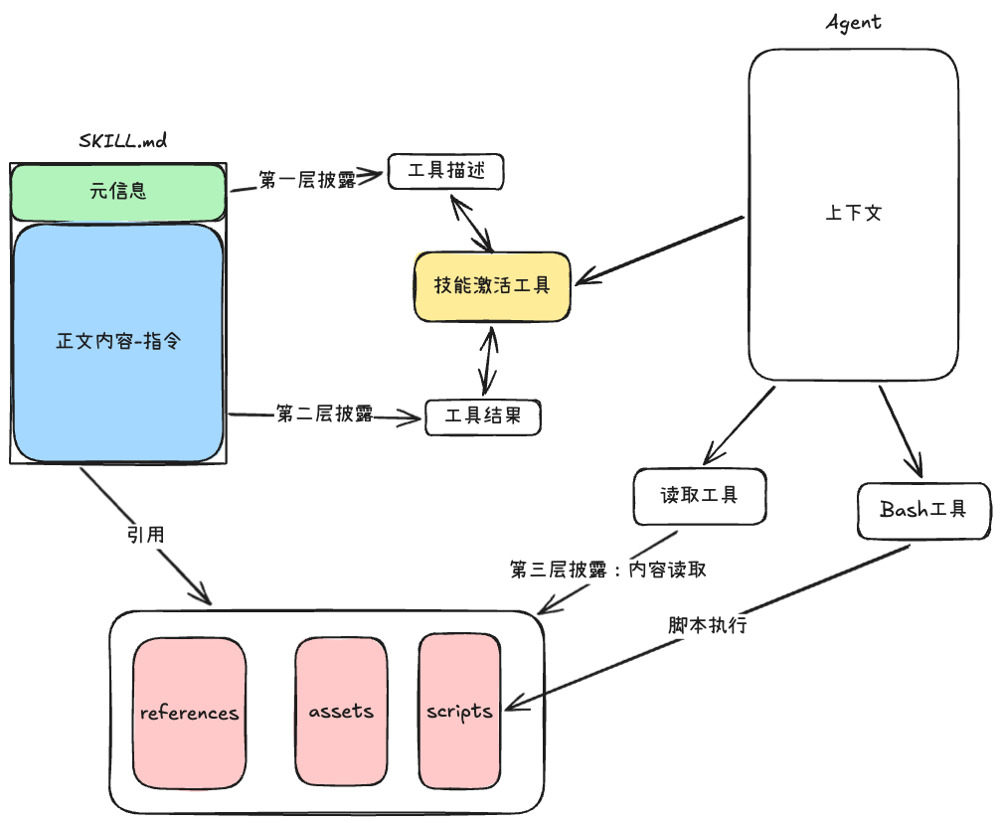
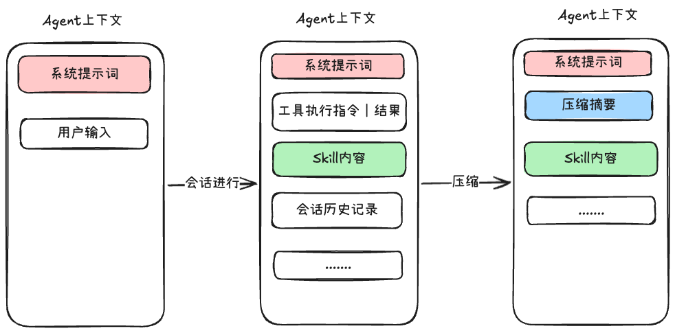

# 为你的 Agent 集成 Skill 系统

为自己开发的Agent添加Skill支持时，开发的核心步骤：**发现、解析、使用、管理**

1. 发现：你的Skill存储在哪里，本地还是云端，项目级和用户级的优先级是什么，如何确定该文件夹是一个Skill
2. 解析：将SKILL.md的元信息解析出来
3. 使用：Agent如何使用解析出来的元信息，是系统提示词还是工具描述，后续的渐进式披露策略的执行，是使用读取工具还是使用内部的激活工具
4. 管理：如何维持加载进入上下文的Skill的有效性，上下文压缩的时候Skill的内容是否需要保护

🌟 **开发的核心原则也是Skill的核心特点：渐进式披露**

Excalidraw文件：https://my.feishu.cn/file/V5kabOooOo5hZVxmAjCcFilJn5f?from=from_parent_docx





- 第一层披露：在会话启动的时候，将**元信息（名称+描述）**加载到上下文中
- 第二层披露：在Skill激活的时候，也就是Agent根据用户输入和元信息匹配到相应的Skill，将**完整的SKILL.md内容**加载到上下文中
- 第三层披露：当SKILL.md的正文内容加载到上下文之后，Agent根据任务的复杂情况来选择加载更详细的指导说明，也就是**脚本、参考资料、静态资源**这三种可按需加载的资源

## 一、发现

Agent是需要从相应的文件目录中发现运行环境有哪些Skill，大部分Agent是运行在本地环境的，所以我们重点说一下本地环境的Skill发现

对于Skill的文件目录的范围是分为两种的：**用户全局范围和项目局部范围**

- 项目局部范围：只对当前项目生效的SKill，例如：前端设计Skill、React最佳实践SKill等
- 用户全局范围：对用户所有的项目生效的Skill，例如：find-skills（发现Skill）、pptx(生成ppt的Skill）

ExcailDraw文件：https://my.feishu.cn/file/JfaxbHpFaogKJsxHCDrc99dAnlp




具体的Skill的目录模块是这样的：

1. `<project>/.<agent-client>/skills/`：项目范围的可用Skill
2. `<project>/.agents/skills/`
3. `~/.<agent-client>/skills/`：全局范围的可用Skill
4. `~/.agents/skills/`

从上面的路径中可以发现存在`/.agents/`的文件路径，这是因为该路径已经成为跨各种不同的客户端技能共享的广泛采用的约定，例如：

> 别人可能开发了a-agent-client，它的Skill的目录是`~/.a-agent-client/skills/`，你这个时候开发的b-agent-client想要使用a的Skill目录，你就要做兼容，读取目录的时候特定读取`~/.a-agent-client`，一个当然不要紧，那假如有很多个呢？并且路径都不一样，那岂不是每次都要更新这个东西，
> 所以大家就采用一种约定俗成的规范，无论什么客户端，都可以给安装的Skill提供`~/.agents/skills/`这个目录，那么后续开发的时候就都可以默认读取一下这个目录，**达到兼容各种客户端统一规范的目的**

**🌴 所以读取/.agents/的文件路径意味着其他符合规范的客户端安装的Skill会自动对你的客户端可见，相反别人也可以自动可见你的**

**有时候会在用户全局范围和项目局部范围出现相同的Skill**，这个时候优先级判断是：

- 项目级优先级大于用户级
- 相同范围内，按照发现顺序排优先级

设计信任检查的考虑是因为，有一些项目拉取下来会存在一些skill，可能这些skill是恶意不安全的，可能会泄漏你的密钥等隐私性的东西。

所以在Agent的配置文件中可以考虑设计一层skill信任检查，在项目范围内，只有受信任的Skill才可以加载使用，这个是在业务逻辑层面进行判断的

🎃 一点开发技巧的小补充：

在读取skills文件夹的时候，要**查找包含名为SKILL.md的子目录，**这个才是有效的Skill，是符合Skill规范的，一些开发读取Skill路径技巧：

- 要跳过不包含skills的目录，例如：node_modules/这种依赖项文件
- 可以考虑遵守项目的.gitgnore文件，避免扫描一些构建产物，类似于dist/文件夹
- 不要一直嵌套循环的深度搜索，要设置最大搜索层数(5-6层)，同时设置最大文件数量

## 二、解析

在Agent会话开始的阶段，是需要将Skill的元信息加载到上下文中的，所以我们在获取到Skill的文件路径之后，下一步就是需要解析SKILL.md的元信息啦

<b>SKILL.md的文件包含两部分：</b>

1. 以`---`分隔符分开的YAML前置元数据
2. 以结束分隔符分开的MD格式的内容

这些元信息的字段和约束如下：

- name（必需）：表示技能的名称，最多64字符，仅允许小写字母、数字、连字符。不得以连字符开头或结尾
- description（必需）：对于该技能的描述，最多1024字符，不能为空
- license（可选）：对于许可证名称或者许可证文件的引用
- compatibility（可选）：表示环境的要求（目标产品、系统包、网络访问）
- metadata（可选）：附加元数据
- allowed-tools（可选）：技能允许执行的工具列表

那么详细的开发步骤为：

1. 找到SKILL.md文件分隔符的开始和结尾部分
2. 解析中间的YAML代码块，提取出来name和description字段，还有其他的可选字段
3. 而结尾分隔符后面的MD语法格式的内容就是SKILL.md的正文内容

**在对于YAML解析的时候，错误处理不要太严格，小的错误不能影响Skill的解析，可以将错误信息返回给用户，以此进行警告提示**

🤔 那么解析之后的SKILL.md的元信息，是需要加载进入Agent的上下文中的，如何存储是一个值得考虑的问题

我们可以使用Map这种键值对的格式，**将这些元信息存储在内存中**，name作为key，vlaue值至少需要下面三个字段：

- name：名称
- description：描述
- **location：SKILL.md文件的绝对路径**

关于是否需要将md格式的正文内容也加载进来，有两种考虑，如果直接加载进来的话，内容存储会变大一些，但是在渐进式披露第二层的时候，读取速度会很快，如果不加载进来，那内存会小一些，等进入第二层上下文加载的时候，就要再读取这个SKILL.md文件，IO读取会影响整个Agent的响应时间，这里需要自己根据实际业务进行权衡

## 三、使用

### 3.1、将元信息放入到系统提示词中

Excalidraw文件：https://my.feishu.cn/file/WexKboR2yodMeuxHA0Xcgz2anGm




1. 在Agent会话初始的时候，将元信息放入系统提示词中，**放入的时候要提供一个简短的Skill使用说明，告诉模型如何使用以及什么时候使用**，这个是第一层披露
2. 当用户输入或任务触发了相应的Skill的时候，这个时候Agent会调用读取工具读取完整的SKILL.md，这个是第二层披露
3. 完整的SKILL.md加载进入Agent上下文中之后，遇到任务复杂度很高，Agent需要得到更加详细的“说明文档”，这个时候会继续调用读取工具，从SKILL.md获取的引用路径读取相应的references、assets、scripts
4. 如果读取到scripts的时候，有需要执行脚本的需求，那么Agent就会调用Bash工具执行脚本文件

在将元信息放入到系统提示词中的时候，采用一些特定的格式，XML、JSON等，后续在上下文管理的时候会非常有效

```xml
<available_skills>
  <skill>
    <name>code-review</name>
    <description>Review code for bugs, style issues, and best practices. Use when the user wants feedback on their code.</description>
    <location>/home/user/.agents/skills/code-review/SKILL.md</location>
  </skill>
  <skill>
    <name>git-commit</name>
    <description>Generate clear and conventional git commit messages from diffs or change descriptions.</description>
    <location>/home/user/project/.agents/skills/git-commit/SKILL.md</location>
  </skill>
</available_skills>
```

location字段表示的是SKILL.md的完整绝对路径，它的用途有两个：

1. 给读取工具提供正确的路径参数
2. 为模型提供一个基本的路径参考，用于正确读取SKILL.md内容中的引用资源(reference、assent、scripts/xxx.js)

🎃一点开发小建议：可以再提供一个文件列出的工具（listFiles），这样在第三层披露的时候，模型有工具可以“自修复”路径导致的读取错误

### 3.2、将元信息放入到专有的工具中

Exalidraw文件：https://my.feishu.cn/file/RFb9bjrQIop6RIxebRhcTw4Vnyb



1. 在会话开始的时候，Skill的元信息会以工具的描述的格式提供给Agent，这个是第一层渐进式披露
2. 当Agent需要更完整的SKILL.md内容的说明，传入给工具的参数是name，工具返回的是SKILL.md的内容，重点是对于引用资源的路径展示更为准确和具体了，这个是第二层渐进式披露
3. 在第三层披露中，Agent可以使用读取工具去获取完整的引用资源的内容，当然这里你也可以单独在创建一个工具获取引用资源的内容，也不一定仅依靠读取工具
4. Bash工具依旧有效，可以执行skill中的scripts脚本文件

使用专用工具和系统提示词这两种方式都是有效的，但是专用工具比系统提示词在**开发控制**上面更具有优势：

- 控制返回的内容 - 只返回SKILL.md中的正文内容，而不是重复返回元信息
- 在上下文管理过程中，工具的返回结果可以单独做一些特殊的标记，在上下文压缩的时候是可以跳过筛选出来
- 引用资源是以结构化的列表形式展现，在模型理解上更加友好
- 可以做一些独特的控制流，工具是否执行等操作
- 可以做一些统计分析的功能

```xml
<skill_content name="code-review">
# Code Review

## 何时使用
当用户需要对代码进行审查时使用此技能，包括 Bug 排查、
代码风格检查、最佳实践建议等。

## 审查步骤
1. 阅读代码，理解其意图
2. 对照 references/style-guide.md 检查风格问题
3. 运行 scripts/lint-check.sh 进行静态分析
4. 输出结构化的审查报告

Skill directory: /home/user/.agents/skills/code-review
此技能中的相对路径均相对于上述目录。

<skill_resources>
  <file>scripts/lint-check.sh</file>
  <file>references/style-guide.md</file>
  <file>references/common-bugs.md</file>
</skill_resources>
</skill_content>
```

关于`skill_resources`的内容，之前是需要依靠SKILL.md中书写相应的引用介绍，但是如果是工具结果返回，我们可以单独将相应的skill下面的reference、scripts、assent文件夹都读一遍，然后将文件路径放入到`skill_resources`标签中，**要注意限制文件列表大小，不要过大了，同时要向模式释放信号“当前的列表可能不完整，具体情况具体分析”，这样不会让模型在自主运行的过程中被工具返回内容限制**

## 四、管理

Excalidraw文件：https://my.feishu.cn/file/OOAPb3RTdoNnAQxbAjrcjNF8niA



渐进式加载的意义是**避免预加载所有Skill**，因为有些Skill刚开始可能不会使用到，加载进去是上下文的浪费

**但是已经加载进来的Skill内容，是值得在会话中持续保留的**，因为skill已经成为了当前会话中Agent的一种任务行为指导，如果盲目的压缩，是会降低Agent的性能，保留skill的内容有两种方式

1. 系统提示词的使用：在读取工具的结果中，识别相应的结构化标签，来保留skill的内容
2. 专用工具的使用：将技能激活工具的输出标记为保护状态，在压缩的时候进行标记判断

但是这也要根据实际情况来看，如果我们的对话很长，skill数量很多，上下文窗口小，不压缩的话，根本没有新的上下文空间给剩下的任务执行链，那么这个时候压缩是更优解

**但是压缩之后，要显示的提示模型“skill也被压缩了，如有需要请重新加载相应的skill”**

不然模型会陷入压缩幻觉，“觉得自己里面已经有了相应的skill，不用在加载了”

还有一种更高级的用法：**使用subAgent（子智能体）运行Skill**

子智能体的整个执行过程（技能指令+引用文件+中间推理）都发生在它的上下文窗口中，主智能体的上下文完全不受污染，只看最终结果

在开发的时候，我们可以将“执行Skill”这个行为创建一个子智能体，将用户输入+Skill元信息注入给子智能体，最终子智能体返回结果给主智能体消费

具体是否使用子智能体来执行Skill，要交给主智能体自己来判断，例如：任务超过阈值的时候就自动委托

## 五、快速构建

上面提到的方式，是你从头给Agent构建一个支持Skill的功能模块，里面涉及到的元信息加载，正文内容读取，资源文件读取的功能，由你来创建一套读取工具或者读取Skill内容的工具

目前的生态比较成熟，很多Agent SDK是开箱即用这个Skills功能模块的，只要引入SDK下的Agent方法，那么Agent就自带skills加载的功能，接下来我给大家使用Claude Agent SDK构建一下看看，开发起来非常方便快速

1、Agent运行文件

```python
"""简化版,主要展示核心流程的步骤，尤其是调用和输出结果解析"""
async def _run_repl_async() -> None:
    config = load_runtime_config()
    apply_runtime_env(config)
    client = build_client(config)

    # 输入
    try:
        user_input = input("\n> ").strip()
    except (EOFError, KeyboardInterrupt):
        return print("\n再见!")

    # 请求 + 接收
    try:
        print("[发送请求...]")
        await client.query(user_input)

        print("[接收响应...]")
        events = [e async for e in _iter_events(client)]
    except Exception as exc:
        print(f"[错误] {exc}")
```

2、Claude Agent SDK核心运行配置文件

```python
"""SDK 封装 - 简化版"""
from __future__ import annotations

from pathlib import Path
from app.config import RuntimeConfig

# 允许 Agent 使用的工具列表
ALLOWED_TOOLS = ["Skill", "Read", "Write", "Edit", "Bash", "Grep", "Glob"]

def build_client(config: RuntimeConfig):
    """创建 Claude SDK 客户端"""
    try:
        from claude_agent_sdk import ClaudeSDKClient, ClaudeAgentOptions
    except ImportError:
        raise RuntimeError(
            "请先安装 Claude Agent SDK: pip install claude-agent-sdk"
        )

    options = ClaudeAgentOptions(
        #设置project会默认加载项目内的./claude/skills下的skill
        setting_sources=["project", "user"],
        allowed_tools=ALLOWED_TOOLS,
        model="deepseek-chat",
        env={
            "ANTHROPIC_AUTH_TOKEN": config.api_key,
            "ANTHROPIC_BASE_URL": config.base_url,
        },
        # 单独指定skills文件加载的位置，配合user值使用
        add_dirs=["/xxx/xxxx/.agents/skills"]
    )
    return ClaudeSDKClient(options=options)
```

核心就是这两个文件，运行Agent之后，就会自动加载skill文件，同时也会自动使用渐进式披露的策略来进一步加载正文内容和资源文件

> 关于Claude Agent SDK模型最好是使用Claude的，但是因为一些因素无法使用的话，也可以考虑支持ClaudeCode和Anthropic API格式的模型供应商

类似的SDK还有：

- pi-mono中的pi-coding-agent核心包
- kimi Agent SDK

🪐 **如果追求快速构建是完全可以使用这些成熟的Agent SDK构建Skill支持功能的，相应的你的Agent的整体构建设计思路也要去贴合这些Agent SDK，我觉得是有利有弊的，需要开发者们按照场景去选择自己从头构建还是借助SDK集成，**

- 自己构建自由度更高，可操作性更强，
- 使用SDK构建，速度更快，迭代方便，开发难度较小
