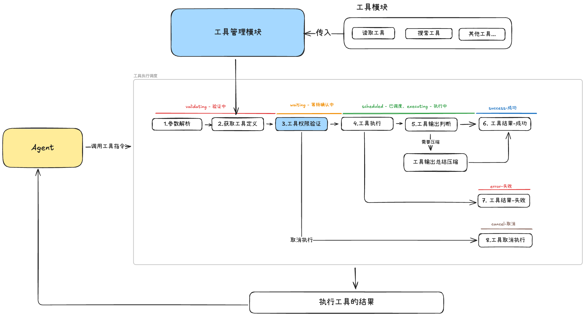
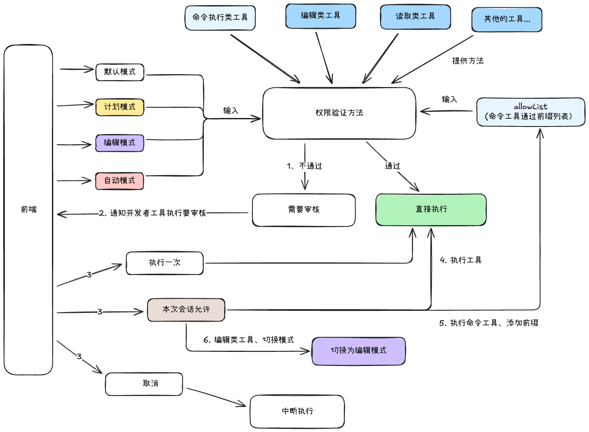
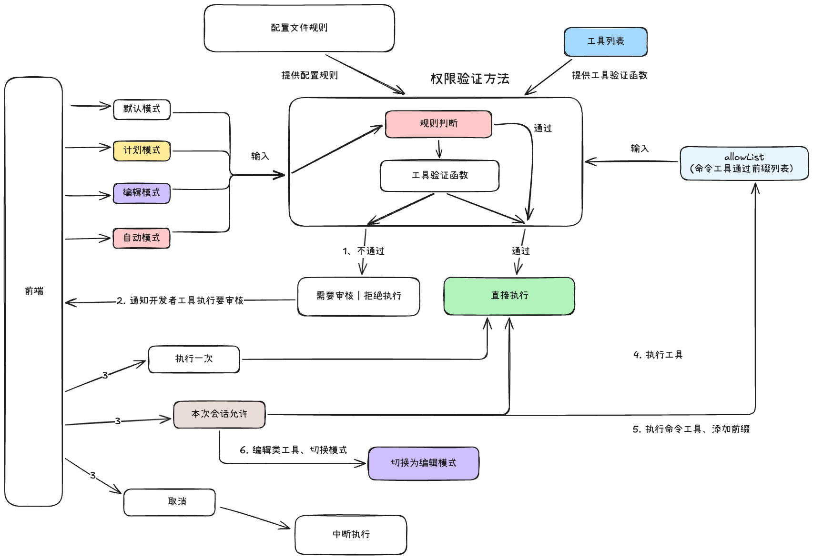
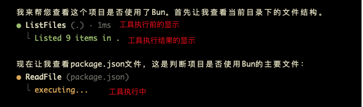
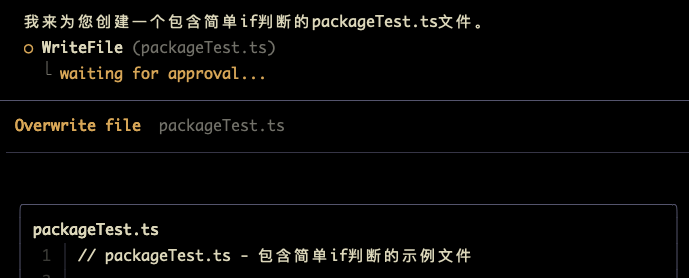
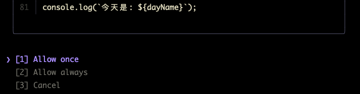

# 工具调度与权限模块的开发

工具权限模式的开发重点就是通过设计几种 Agent 模式以此来判断执行工具的时候，这个工具是否需要用户审核批准执行，但是以此会延伸出来**工具调度的实现和 allowList 的机制**

所以工具权限模块的完整的开发方式是：

1. 工具的权限验证方法和终端的权限验证面板
2. 工具执行的调度
3. allowList 机制

参考的分析资料：

- Gemini-cli：[https://github.com/google-gemini/gemini-cli](https://github.com/google-gemini/gemini-cli)
- OpenCode：[https://github.com/anomalyco/opencode](https://github.com/anomalyco/opencode)
- Kode：[https://github.com/shareAI-lab/Kode-cli](https://github.com/shareAI-lab/Kode-cli)
- ClaudeCode

## 一、工具调度流程的设计

Excalidraw文件链接：https://my.feishu.cn/file/NwcJbEG0soQqr5xGImucKCz6n7B

工具的调度流程设计中，工具的执行状态有以下几种：

1. validating（验证中）： 验证工具的参数等前置状态是否正确
2. awaiting_approval（等待确认）：需要用户批准，正在等待用户批准
3. scheduled（已调度）：工具准备开始执行的，等待批量执行
4. executing（已执行）： 正在执行工具
5. success（执行成功）：工具执行成功
6. error（执行失败）：工具执行失败
7. cancelled（取消执行）：用户取消执行工具或者进程中断

## 二、工具权限验证方法的设计

Excalidraw文件链接：https://my.feishu.cn/file/Q7WJb4ACaoTFfpxWH72cDlHLnzg



1. 计划模式：是完全不能使用编辑和执行命令的工具
2. 默认模式：是所有的工具都可以使用，但是需要批准
3. 编辑模式：所有的工具都可以使用，编辑类工具自动批准，执行命令工具依旧要批准
4. 自动模式：所有的工具都可以使用，所有的工具都自动批准

前端可以进行模式的切换，当 Agent 需要执行一个工具的时候，在工具执行调度模块的地方，会执行工具的验证函数，**每一个工具几乎都有一个验证函数**，验证函数的实现核心是：

1. 获取前端传递过来的模式
2. 根据模式进行判断该工具是否需要审核批准
3. 对于命令执行工具的执行，在命令执行工具的验证函数中会进行 allowList 机制判断

当验证函数返回需要审核批准的时候，就开始进入第二阶段，在第二阶段中就是获取用户的选择，目前有三种模式：

- 执行一次：同意本次工具的执行
- 本次会话允许：在这个会话中，该工具的执行全部都自动批准后续
- 取消：不允许执行该工具

那么本次会话允许的话，对于两类工具的表现是不同的：**命令执行工具和编辑类工具**

1. 命令执行工具：使用 `allowList` 机制保留命令执行的“前缀”，下一次判断就进行前缀的验证
2. 编辑类工具：编辑类工具会切换模式，将模式切换为“编辑模式”

## 三、工具权限配置文件的设计

上面那种工具自身提供验证函数的设计，可以发现模式和用户是被动的，而开发者在设计函数的时候是主动的，

也就是说用户无法修改某一个工具的验证行为，例如：我就想xxx工具一直通过，不需要验证，

用户只能被动的通过切换模式整体设置，这样在权限验证是不够安全的，用户对于Agent的工具调用控制程度也很低

为了让权限模块更完善，我们切换设计角度，**让工具成为被动挑选的，用户成为主动**，也就是说**用户可以通过修改配置文件来达到控制工具验证行为的效果**

```json
// agent的配置文件
{
    "permissions": {
      "allow": ["Read", "Bash(git *)"],
      "deny":  ["Bash(rm -rf*)"],
      "ask":   ["Bash(npm publish*)"]
    }
  }
```

对于配置文件的设计，ClaudeCode最细节，有8个配置数据的来源：userSettings、projectSettings、localSettings、flagSettings、policySettings、cliArg、command、session。这8个文件关于权限规则的部分是叠加的，不会覆盖

那么完整的权限验证系统：


1. 在权限验证方法中有两层大验证，是先后优先级的关系，**规则判断先，工具验证函数后**，如果规则判断通过就直接执行，不继续验证，只有没通过的时候才继续验证工具函数
2. deny（拒绝执行）：这个规则调用位置有点特殊，**分为两次调用**，第一次是在工具注册的时候静态执行，如果匹配到拒绝执行的工具，那么都不注册，模型看都看不到，第二次是在工具执行阶段中的权限验证环节，两次验证的原因是，如果存在工具注册缓存的话，第二次就非常有必要啦，因为有一些工具会动态被加载进来，或者规则修改啦
3. allow（允许执行）：这个规则的执行顺序有点特别，**是在工具验证函数之后执行的，**因为当用户配置了allow数组，a工具允许执行，但是a工具的自身验证函数输出的是普通的ask，或者命令行工具的前缀验证输出的是“我木有意见，交给上面决定”的passthrough，那么allow就可以静默它们这些状态直接放行，刚好发挥了用户配置的作用（可能不是那么大吧）

🎃还有一点小细节的设计：命令行的工具验证和获取方式和其他的工具是不一样的，其会有一些命令前缀的验证过程，匹配的时候也是要单独注意的

 ## 四、终端显示执行的效果和方式

工具的执行状态有利于 cli 终端进行状态的显示，Agent 端进行事件通知采用“发布-订阅”的方式，让 cli 终端可以得到工具的执行状态的推送，那么 cli 终端就可以进行自定义的状态显示

- validating 的时候就显示工具等待中
- awaiting_approval 的时候就显示审核面板，让用户选择执行的方式
- executing 的时候就显示工具执行中的状态
- success、error、cancelled 的时候就当作工具的执行结果显示在 cli 终端





