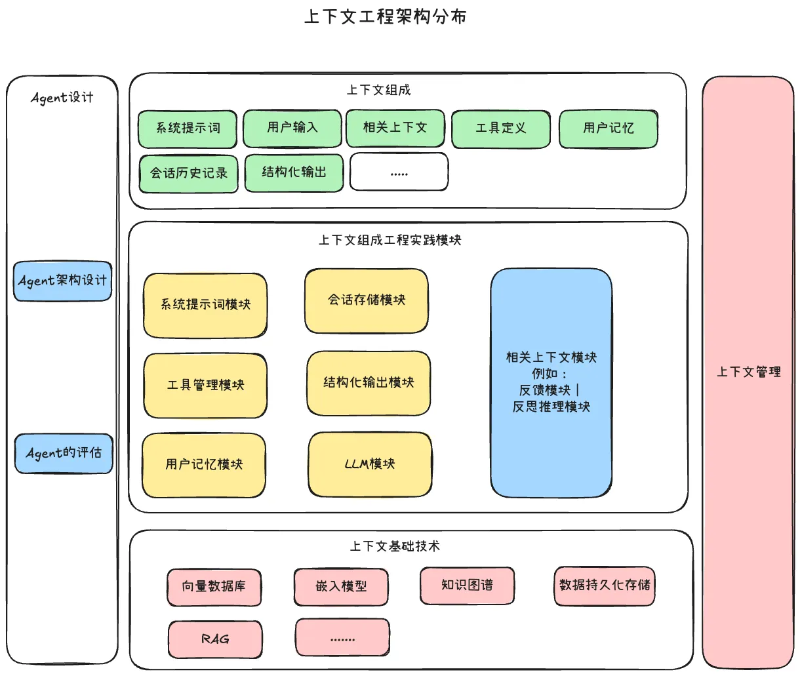
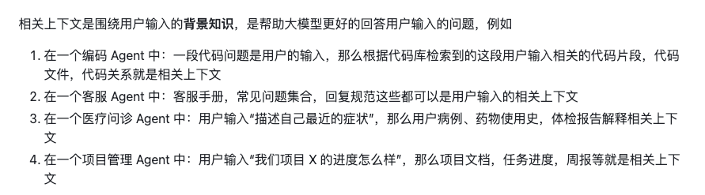
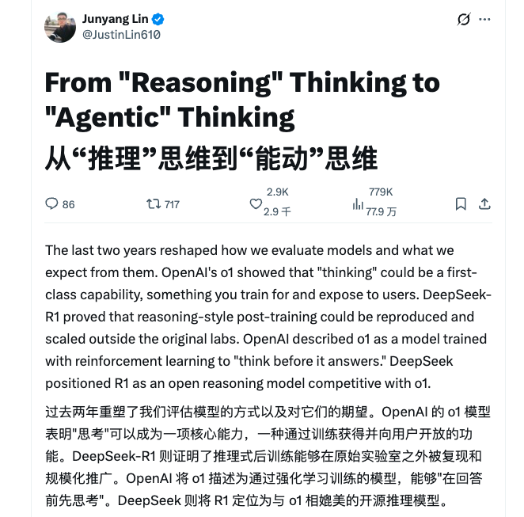

# 从上下文去理解Harness Engineering

许多被标榜为“新“的事物，实际上只是将扎实的工程实践应用到新的领域，**真正的进步不在于术语的翻新，而是在于从实际构建和打破这些系统中获得得宝贵经验**

对于Harness Engineering的理解，更多的重心应该放入到两篇具体的工程实践经验的文章中去：

1. OpenAI的文章：：https://openai.com/zh-Hans-CN/index/harness-engineering/
2. Anthropic的文章：https://www.anthropic.com/engineering/harness-design-long-running-apps 

如果我们只关注这个词的本身含义，那么其实它可以有很多种叫法：

- 驾驭工程 ：直接翻译
- Agentic的编排与集成
- 构建Agent的工作空间

##  一、“束缚”不是最佳理解

但是（仅发表我自己的看法），我并不喜欢“驾驭工程”这个词，有的解释是这样的：

> Harness 这个词直译是“**马具**”。一匹马很强壮，但没有马鞍、缰绳、马镫，你骑不了它。AI 模型也一样，它很聪明，但你得给它一套“装备”，它才能真正干活。

我觉得驾驭和马具这些词，从理解上面就感觉是一种束缚，对于Agent的束缚，

这让我想起来之前构建Agent的Workflow，以工作流的形式来搭建Agent，基于开发者自身对于工程的理解和业务流程的理解，来搭建一套运行骨架，这套骨架被搭建的太清晰啦，以至于Agent运行只能沿着骨架行走，这种方式搭建的Agent只能算是勉强够用，但是并不能发挥模型潜力和自主性

但是在实际的业务落地中，我们会存在各种各样的情况，并且用户的输入也是无法确定的，仅以工作流的形式，是无法完全承担领域革新的任务的

并且随着模型的升级迭代，这套“骨架‘反而成为了限制，而不再是帮助，但是不可否认，WorkFlow是有意义的，是作为整个大模型应用开发工程历史中关键的一环

当然那个时候，Workflow的背后也有着提示词工程的身影，当时大家总觉得搭建有效Agent的核心，是系统提示词一定要完美，而不是以工程思维的方式在思考这件事情

在上下文工程出现的时候，我能感受到大模型能够有更大的希望在某一个领域，某一个业务中具体的落地，像Cursor、ClaudeCode、Lovart、Youmind背后的构建理念在我看来都是有上下文工程的身影的

对于上下文工程，我们还应该去扩大它的理解，因为“上下文”这词可以成为大模型应用的核心理念

> 上下文工程的定义：是在有限的上下文窗口中，选择、组织并注入与用户输入或任务高度相关的信息，从而让大语言模型（LLM）能够在合理的边界内做出最佳推理和执行。

那么如今的“马具”理解，很可能会给许多开发者带来困惑，甚至整个的大模型应用构建生态会被错误回退和理解

所以我想要从上下文工程的角度来表达我对于Harness Engineering的体会，希望能给大家带来另外一层值得参考的思路

##  二、对于上下文的理解之路

在说具体的理解之前，我想和大家聊一些闲话，我是如何产生对于上下文工程是这种理解的

我自己平时也会构建一些大模型应用，也喜欢去琢磨市场上的那些大模型应用的背后思路和理念，还有一些框架的概念呀，一些框架的使用呀，很多时候就会感觉有点杂，为什么它不用这个技术？这是一种什么技术？它怎么用这个技术？

所以对于如何构建大模型应用的理解，我自己感觉就是太多了，太杂了，学不完

突然有一天下午，我刚睡醒看到一篇文章里面提到的上下文这个理念，我发现自己在构建Agent的时候，好像也觉得只有任务注入那一瞬间的上下文是取决定因素的，一个Agent输出的结果或者完成的任务是否有效，取决于注入的上下文足够的精准和相关

顺着这个思路去理解，那么就出现一条线将这些工程概念和技术实践连接起来啦：

- MCP、Skill、Tool、Function Call其实都是外部工具的一种，外部工具就是解决外部数据引入到上下文的工程手段，关键点还是在工具模块注入给上下文的输出要有效，并且在工具实现层面会出现关系数据库的查询，文档向量数据库的语义相似度的查询
- 用户记忆和会话存储：如果将历史记录注入到上下文中，并且如何高效的读取写入，用户记忆里面会延伸出来所了解的知识图谱（GraphRAG），和现在的文件系统的md格式读取，最核心的不是实现，而是用户记忆如何去构建，例如：给用户记忆分层，长期记忆、短期记忆、工作记忆这种概念设计
- 系统提示词：里面是现有的提示词工程的产物，写好一个优秀的系统提示词的方法
- 结构化输出：在模块耦合的情况下，Agent内部要有效的数据传递，需要我们使用结构化的输出来处理之后，再次输入，所以结构化会延伸出来一些实现方式：提示词实现，工具实现，参数实现，哪一种结构化对于模型比较友好，XML，JSON，CSV，TOML等
- LLM模块：像LangChain，opencode这些工具，都要适配现有的各种模型厂商的API格式，所以一个Agent，尤其是多Agent要有这个模块，来支持丝滑调用各种模型
- 上下文管理：上下文压缩、架构解决方案（采用多智能体），协同Agent和自主Agent等
- Agent的评估：关于LangFuse这些框架的作用，还有提示词工程中讲究的更新机制，都是依靠评估模块来迭代实现的

所以思路收束回来，那么就可以理解啦，几种核心的上下文类型是这些东西的头和起点：系统提示词、用户记忆、工具定义和输出、会话历史记录、结构化输出、用户输入，这些类型组成一个完整的上下文，在那一瞬间注入给LLM，以此借助内部的推理链来完成用户输入的任务

**而我们大模型应用工程师的作用就是保证注入给LLM的上下文足够精准和有效，使LLM可以在合理的边界内做出最佳的推理和执行**

所以后面我就以自己这套上下文工程的理念去理解各种Agent、各种框架、各种新概念，这样脑子里面就有一条总线牢牢抓住你的思维，不让自己走偏，

当出现新概念，新框架，我就会问自己“它在上下文工程的那一个部分，那一个环节中”，而依靠上下文工程的理解去构建的Agent，目前来看都是非常有效的，我自己构建的也是如此

当然我对于上下文工程的理解，或许是片面的，这里面肯定有更多技术的挑战和细节，而我的理解极可能随着领域不断发展和模型的升级，还有一些优秀的产品不断迭代，会逐渐过时，因此保持灵活和谦逊是非常必要的。

我希望自己可以通过实践再重新学习的方式强化这些概念，同时我将这些理解整理成文发布出来，希望借助整个开源社区来“锤炼”这套概念，来为其去除糟粕，留下精华

我也很希望自己对于大模型应用的理解足够完善，以此构建更好的Agent产品

## 三、从工作空间去理解Harness Engineering

那么接下来从上下文的角度去理解Harness Engineering会是什么？

在原本的上下文的类型组成中，一直有一个我无法完善，并且去解释清楚的一种类型的上下文，解释“相关上下文”，我对于它的理解是：

> 相关上下文这个对于开发者来说是最有挑战性的，这个变动性是最大的，每一个 Agent 或许都有属于自己独特的相关上下文模块设计的架构

在Harness Engineering这个概念出来的时候，我有感觉了，相关上下文就是Context Engineering和Harness Engineering的通道，也就是Harness Engineering的源头，上面的那些博客，其实就是相关上下文在不同Agent和任务中的不同表现，是一种实践经验，得出下图：、

Excalidraw文件：https://my.feishu.cn/file/NQLnb4TcXoXDxAxh5AMcSrcQnue

所以Harness Engineering我的理解就是，它真正在做的事情是定义边界和协作协议，而不是控制每一步的执行

**它不是在限制模型能做什么，而是在创造条件让模型能做到原本做不到的事。**

**工程师们应该构建Agent的工作空间，让Agent可以稳定有效运行在那个领域环境，**

那么大家更多应该去关注不同领域下的，这个Agent工作空间是如何构建的呢？而在这个工作空间下，Agent的执行结果的中间产物就是相关上下文

目前OpenAI和Anthropic给出大家实践参考，告诉大家要构建一个编码领域的长期运行的Agent，需要使用到那些工程方式和概念

接下来我也会仔细去阅读那两篇工程实践的文章，梳理出来一个我的理解

## 四、从“Reasoning”到“Agentic”的理解

林俊旸在X上面发布了一篇文章，我觉得很有意思，是我第一次感受到在模型训练阶段中，也需要从传统的方式转变，我之前一直是从大模型应用的角度去思考这个问题

原文链接：https://x.com/JustinLin610/status/2037116325210829168

早之前我做Agent的时候，有尝试过加深推理链的使用，多Agent进行辩论推理之类的方式，但是我发现这很容易陷入到“错误的信息中试图推理出来正确的答案”的悖论，

我认为只有在确保注入的上下文已经处理到极限啦，在任务相关性上面，那么这个时候推理会是解答问题的“火箭”高效且有用

就像那篇文章提到，“我们不能陷入无限的经验主义，应该也要靠实践去反复论证，并且打破认知重新塑造”

人类正确认识运动的秩序：“从特殊的事物出发，逐步扩大到一般的事物，然后总结概括认识事物的本质，最后再回到事物的特殊性”，不同的问题在大层面下有不同的解决方法

倘若只专注推理思维链的话，就像是关在书房里面富有知识的学者，能解决一些问题，但另外一些问题因为缺乏实践反馈的再理解是永远无法解决的

所以从Reasoning转变到Agentic是跨越问题的一大步，Agentic思维关注的是模型在与环境交互时能否持续取得进展。具体的几个表现如下：

1. 模型决定何时停止思考并采取行动
2. 选择调用哪个工具以及调用顺序
3. 整合上下文中因环境读取到的嘈杂或不完整的结果
4. 失败后重新修改计划
5. 多轮对话和多次工具调用中保持连贯性

而原文最棒的一句话我觉得是这句：清晰的阐述了Reasoning思维和Agentic思维的差异

> 我预计，Agentic思考将成为主导的思考形式。我认为它最终可能会取代大部分旧有的静态独白式Reasoning思考：那种试图通过输出越来越多的文本来弥补交互不足的、过度冗长且孤立的内在轨迹。即使在非常困难的数学或编程任务上，一个真正先进的系统也应当有权进行搜索、模拟、执行、检查、验证和修订。其目标是稳健且高效地解决问题

文章中关于Harness的理解，在这一段中很明显，我觉得就是在阐述Agent运行空间的重要性，或者是工作空间的重要性，如何让一个Agent在某一个环境下能够稳定运行并独自获取任务相关上下文的能力是接下来至关重要的，例如：反馈验证模块给Agent提供了环境的兼容性，任何环境下的问题，Agent都可以先试一下，动手实践一下，通过反馈信号的完整性，可以纠正Agent的推理和计划思路，以此来真正的解决这个问题。

> Agentic思维也将意味着Harness Engineering。核心智能将越来越多地来自多个代理的组织方式：一个负责规划和分配工作的协调者，像领域专家一样行动的专业代理，以及执行更具体任务、同时帮助控制上下文、避免污染并保持不同推理层次之间分离的子代理。未来是从训练模型转向训练代理，再从训练代理转向训练系统。
