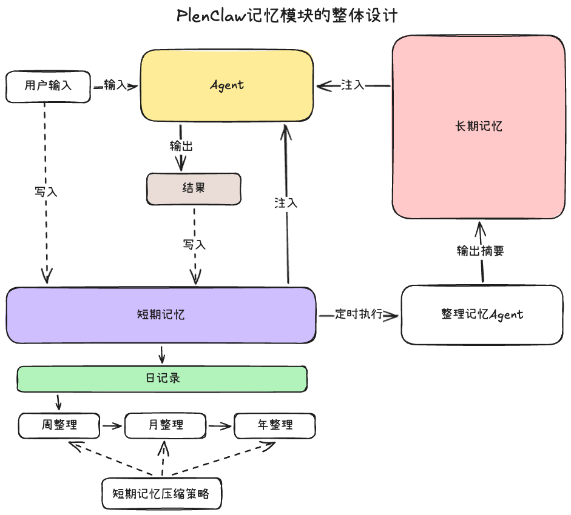
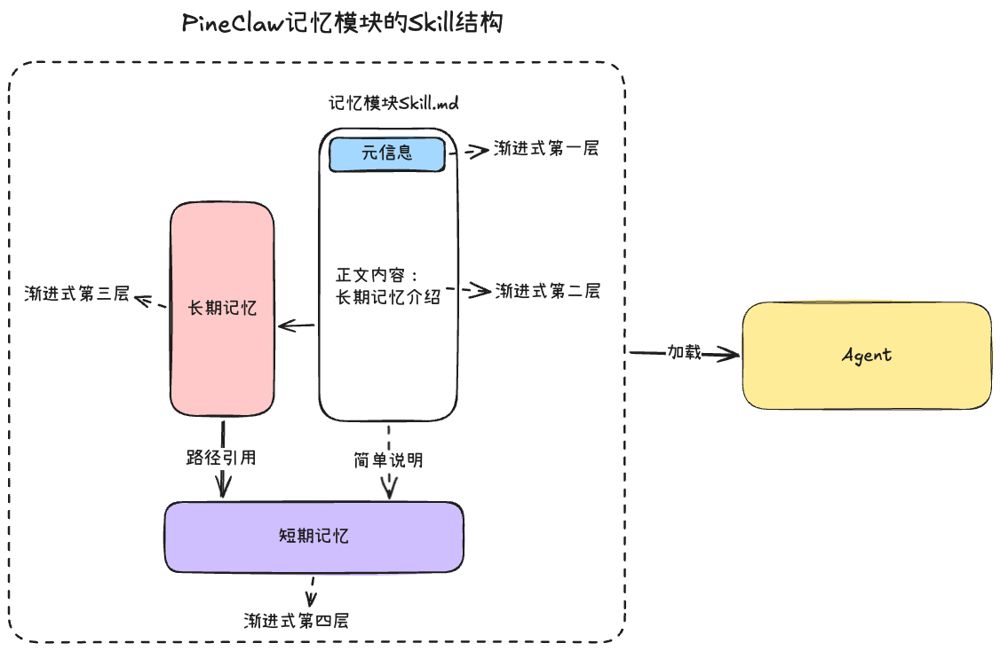
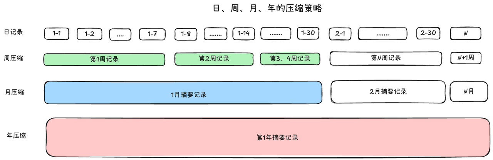
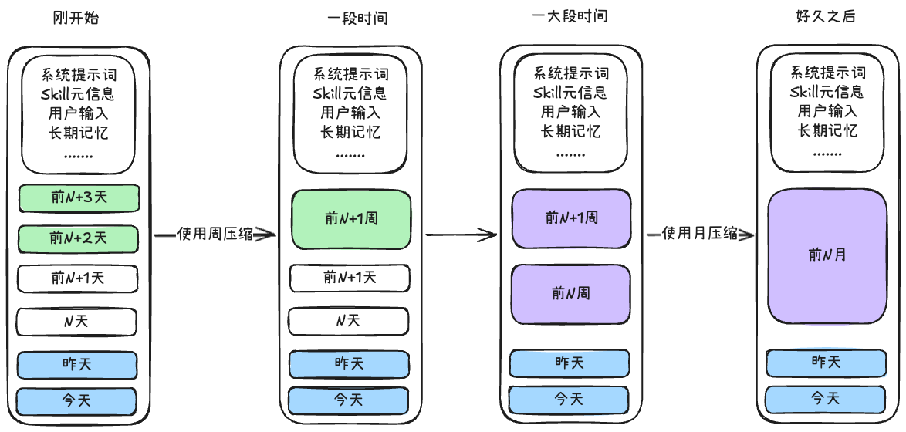
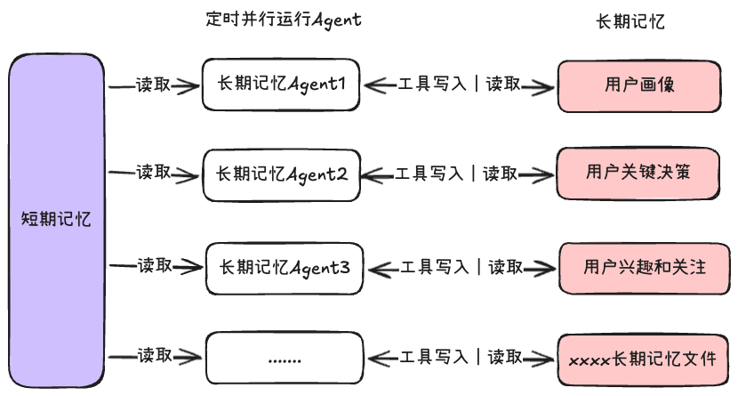

# 助手Agent记忆模块的设计

HeartClaw这个Agent定位是的个人助手，主要的是个人陪伴和助手、所以对于记忆模块的设计是非常重要的，其不像其他的Agent是以任务驱动的，任务完成之后，整个工作空间就可以随时关闭，但是个人助手的Agent的工作空间是漫长的，不是片刻的，我对于HeartClaw的记忆模块的设计：

1. 短期记忆：就是每天聊天的历史记录文件，我不喜欢“会话”这个词用在个人助手中，所以我设计层面避免啦

2. 长期记忆：是想要持续存储的，并根据具体情况加载进入Agent的上下文的

3. 遗忘机制：我不想全部的记忆注入到上下文中，事无巨细的注入，我觉得对于Agent来说不是最优解，注入给Agent应该是一些主要的事件，关键的节点我觉得这个就应该够了


同时存储的格式我想要和开放生态Skill结合，这样用户可以随时移植自己的记忆数据，使用到其他的Agent上面，单独的设计一个文件夹结构和文件类型，没有很大的必要，用户对于自己的数据是有完全控制的权利的

并且将这部分关键的上下文可以共享出去，那么对于其他的Agent来说，能够更加高效的解决用户的问题，也能更好的回复用户，对于整个Agent生态来说是非常好的事情


Excalidraw文件：[HeartClaw记忆模块整理设计\.excalidraw](https://my.feishu.cn/file/F6j3bM2pAoXsk6xsueVccvEqnXf)



## 一、记忆模块存储方式

记忆模块使用md文件的格式存储，采用的是Skill规范。

因为我觉得用户产生的记忆数据，是用户独享宝贵的，**用户是有完全的控制权的**，为了方便用户迁移使用，整个文件的结构是符合Skill规范的，这样用户使用其他的Agent的时候，如果这个Agent支持加载Skill的话，那么用户完全可以导入使用

Excalidraw文件：[记忆模块的存储\.excalidraw](https://my.feishu.cn/file/GwqAbfkXZohqFrx6rCdceuVdnld)



记忆模块的结构是符合渐进式披露的，一共有四层

1. SKILL\.md的元信息：对于记忆模块的简单描述

2. SKILL\.md的正文内容：这个里面是对于长期记忆中的文件介绍，让Agent按需加载相应的记忆文件，同时会简单介绍一下短期记忆的位置

3. 长期记忆：这里会有几种不同类型的数据，**用户指令、用户画像、纠错记录、事实与决策、话题与兴趣，**每一种类型是一个单独的文件，长期记忆来源于对短期记忆做的摘要总结，里面也会引用相应的短期记忆文件的路径

4. 短期记忆：这个就是用户的聊天记录文件，一般Agent叫做“会话记录文件”，但是我觉得个人助手Agent是没有“会话”这个概念的，因为陪伴是永久长期的，不是以任务目的的短期一段时间，所以我在设计上面取消“会话”这个概念


## 二、短期记忆

短期记忆的文件是以月为文件夹组织存储的，文件格式是jsonl，文件的内容的是用户输入、模型输出、工具调用这些完整的推理链。模型的上下文窗口是有限的，用户一直聊下去的话，会导致上下文窗口爆掉

如果只是简单的使用加载固定前几条的短期记录策略，这会让个人助手Agent失去意义，只是简单的会话聊天

所以要有一套完整的压缩策略，对于短期记忆来说，和人一样会有压缩遗忘的机制，我设计了三种压缩的策略，**周压缩、月压缩、年压缩**

Excalidraw文件：[短期记忆日周月年压缩策略\.excalidraw](https://my.feishu.cn/file/BUCpbaszjo79UixVgqJcEUhknKg)



这三种压缩策略的侧重点是不同的，并且输入的原始文件也是有区别的：

- 周压缩：侧重点在“这周发生了什么，时间线是什么”，追求事件的完整性，输入的原始文件是本周日记录

- 月压缩：侧重点在“这个月的核心决策和变化是什么”，追求关键节点的变化，输入的原始文件有两种：一个是本月的日记录，一个是刚刚压缩好的周记录

- 年压缩：侧重点在“这一年最重要的里程碑是什么？”，追求年度关键大事件的总结，输入的原始文件是月记录，这个是从大模型的上下文窗口来考虑的，输入月记录是最优解在成本和技术上面


下面是详细的Agent触发压缩策略时上下文的结构的变化情况

Excalidraw文件：[短期记忆上下文结构变化\.excalidraw](https://my.feishu.cn/file/VcwqbFlQzowTzBx7jiac5h9LnPc)



1. 周压缩：当上下文中都是日记录的时候，触发上下文压缩，这个时候会以7天为一周开始进行周压缩

2. 月压缩：**当上下文中都是周记录之后**，还是触发了上下文压缩，那么就会按照30天或者4周一次进行月压缩

3. 年压缩：当上下文中都是月记录的时候，这个时候的压缩策略是读取月记录，进行摘要总结


🌴 关于月压缩输入文件是日记录还是周记录，这个取决于成本和信息密度的平衡

- 如果追求低成本，高响应，对于信息密度只是简单的总结压缩，那么可以考虑输入周记录是最佳的

- 如果追求信息密度，每一种类型文件侧重点不同，如果输入周记录，会稀释很多关键的信息，只有输入原始的日记录是最佳的，但是成本会高一点


我觉得遗忘机制挺好的，人需要遗忘机制可能也是因为存储空间的问题，对于Agent来说，不一定有这种物理空间的烦恼，但是去掉这个因素，我们仔细感受遗忘机制的另外一层含义

当一个人永远不会忘记，永远会记得细节，那么当他遇到了一次选择的时候，他极可能会分析脑海里面的相似记忆，理智的进行“权衡利弊”，但其实我们都知道，没有最好的选择，分析完成之后，任何选择好坏对半开，这个时候需要一些感性促使你去选择不同以前的

满的记忆存储，就不会有主次之分，就会迷失在这巨大的记忆空间里面，我觉得人是很微妙的的组合，因为我们会清理记忆，产生遗忘，所以我们会格外的珍惜很多事情，着重去感受某几件事情，可能是美好的，也可以是深刻难忘的


所以从这个角度出发，Agent也不应该事无巨细的全部永久记住，使用策略来达到一些“遗忘”，如果太完整的短期记忆加载进入，会让这一次的注入出现上下文冲突和上下文干扰，会让模型固化选择从而没有灵性，当然这一点的设计是我自己的刻意为之的，仅供大家参考

我重点关注的是在使用压缩和总结尽可能的保留一些关键的信息，信息尽可能的真实，以此保证上下文的干净有效


## 三、长期记忆

存储的长期记忆，是定时从短期记忆总结来的，我设定一个“睡眠”的辅助功能，在睡眠的时候，记忆总结Agent就会运行起来，读取今天的短期记忆的文件，输出长期记忆模块想要的总结，在长期记忆中存储的文件类型有这几种：

1. **用户指令文件**：用户对于Agent明确的指令和规则，类似于CLAUDE\.md和AGENTS\.md

2. **用户基本信息和个人画像**：这个是构建对于用户的整体认识

3. **用户确认的事实和重要决策**：这个里面存储的是大事件线下，用户的关键决策

4. **用户的兴趣和关注的领域**：对用户有更深入的了解，以此进行更好的回复

> 这种类型的长期记忆文件，完全可以由自己来设定，建议前期不要设计太多，先轻量运行起来，之后根据运行日志和评估来优化长期记忆文件，来做新增和删减。
> 
> 


长期记忆的更新和写入的机制是：**为每一种长期记忆文件单独设定一个总结摘要的Agent，该Agent会读取短期记忆（日记录）和相应的长期记忆的文件，同时提供写入工具用于更新记忆，**这些Agent触发的时候会并行执行，每一种Agent只负责单一的长期记忆文件

Excalidraw文件：[长期记忆\.excalidraw](https://my.feishu.cn/file/H654brzFjoSc00x0WXgc9PwgnIf)



上面的运行的长期记忆Agent，会有一种工具，用来更新相应的长期记忆文件，关于这个工具的开发，我想要多介绍一下


你当然可以设计三种工具，增加工具、修改工具、删除工具，这样设计是最方便，最清晰的

我个人认为，这样的设计会让整体的工具模块冗余出来，虽然操作层面是清晰的，但是不够优雅，所以我偏向于使用一个工具来实现增、删、改三种操作，这个工具我称为“编辑工具”，实现的理念有参考gemini\-cli这些编程Agent的思路

编辑工具的核心方法非常简单，就是字符替换的方法，JS中使用的是replace方法，我们一起来梳理一下三种操作在替换层面如何理解：

1. 修改操作：字符串A替换为字符串B，很合理

2. 增加操作：字符串A替换为字符串AB，这样就表示字符B是新增加，借助字符的前三句和后三句，就可以实现整体的替换

3. 删除操作：字符串AB替换为字符串B，这样就表示字符A是刚删除的，也是同理借助完整的文本块来替换，间接实现删除操作


所以整体工具的实现就非常简单优雅啦：核心是替换方法，在工具描述中说明“前后各至少3行上下文”，那么工具的参数就是filePath、oldString、newString这三个就可以啦，下面有一个参考的例子：

```Python
edit_memory_def = {
    "name": "edit_memory",
    "description": """对长期记忆文件做精确的局部修改。

使用方式：
- 新增一行：old_string 写锚点行，new_string 写锚点行 + 新行
- 删除一行：old_string 写目标行及上下文，new_string 去掉目标行
- 修改内容：old_string 写旧内容，new_string 写新内容

重要约束：
1. 调用本工具前，必须先用 read_memory 读取文件的最新内容，
   再从读取结果中复制 old_string，不要凭记忆构造。
2. old_string 必须包含目标行前后至少 3 行上下文，确保在文件中唯一定位。
3. old_string 必须和文件内容完全一致，包括空格、缩进、换行符。
4. 如果工具报告找不到 old_string，不要修改 old_string 的核心内容，
   先重新读取文件确认当前内容，再重新构造。
5. 如果工具报告 old_string 匹配到多处，需要在 old_string 中加入更多
   前后行作为上下文，直到唯一定位为止。""",
    "parameters": {
        "type": "object",
        "properties": {
            "file": {
                "type": "string",
                "enum": [
                    "user_instructions",
                    "user_profile",
                    "corrections",
                    "project_context",
                    "facts_and_decisions",
                    "topics_and_interests",
                    "interaction_patterns",
                ],
                "description": "要修改的长期记忆文件名（不含路径和扩展名）",
            },
            "old_string": {
                "type": "string",
                "description": (
                    "文件中要被替换的原文。"
                    "必须包含目标行前后至少 3 行上下文以唯一定位。"
                    "必须与文件内容完全一致，需先 read_memory 再复制，不能凭记忆构造。"
                ),
            },
            "new_string": {
                "type": "string",
                "description": (
                    "替换后的新内容。"
                    "删除操作时，此处写删除后应保留的内容（即 old_string 去掉目标行）。"
                ),
            },
        },
        "required": ["file", "old_string", "new_string"],
    },
}
```


